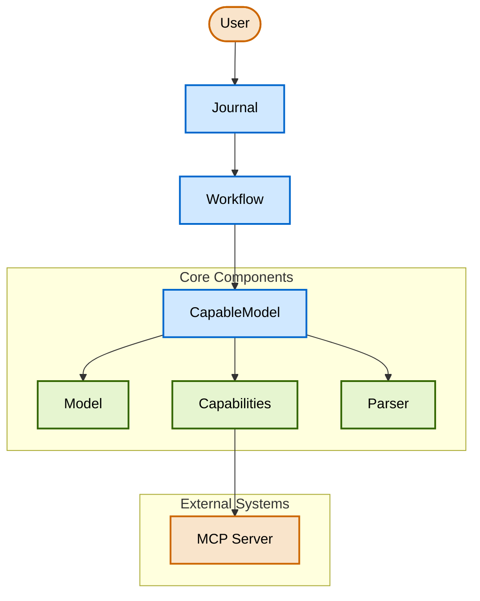
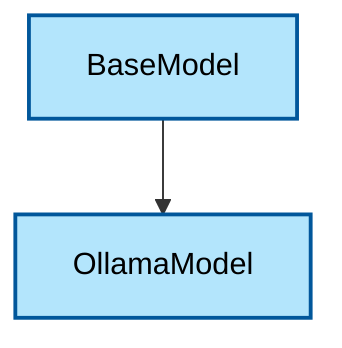
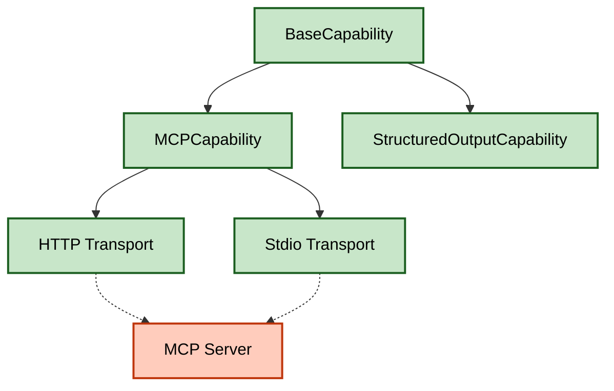
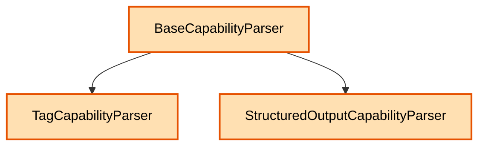
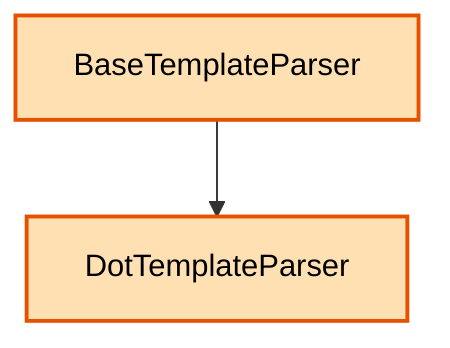
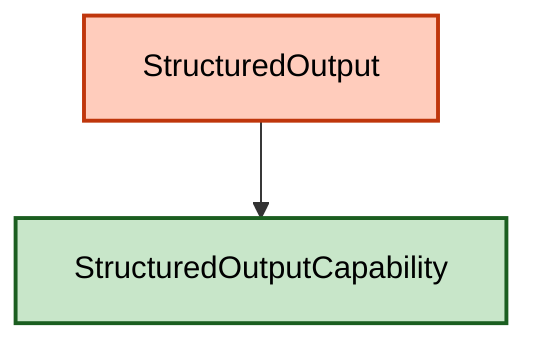
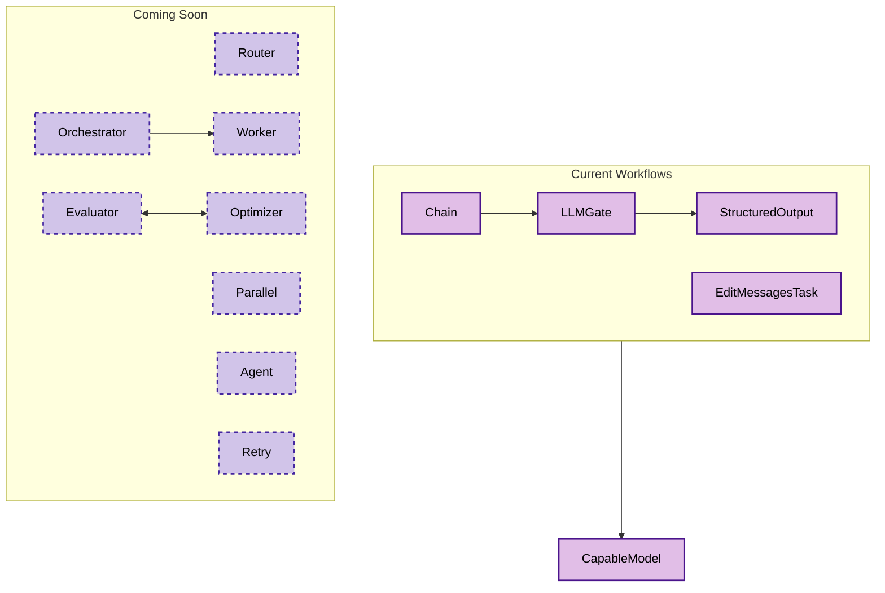
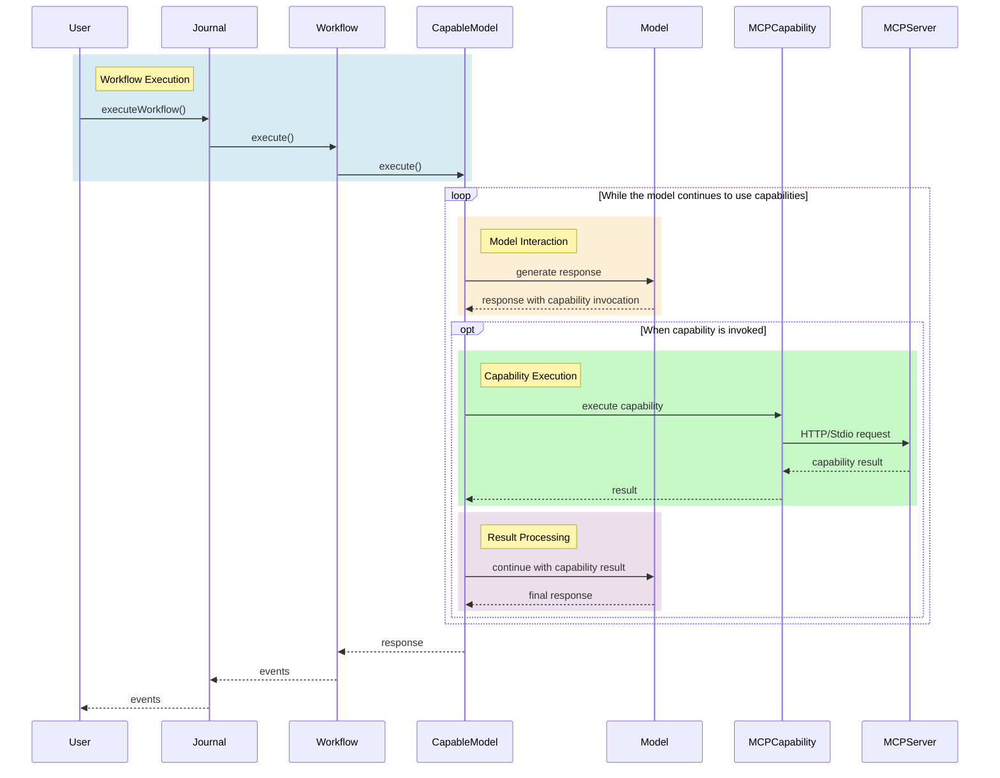
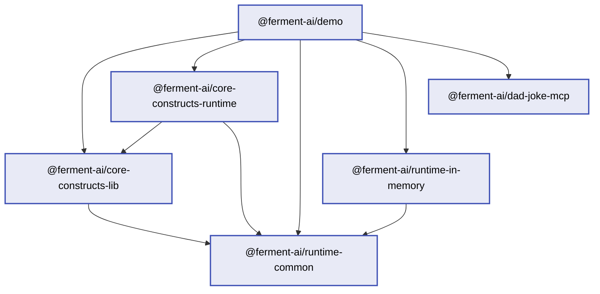

# Ferment AI


A declarative framework for configuring and executing workflow and agent-based LLM systems with unprecedented clarity and control.

## Introduction

Ferment AI is a powerful framework for configuring and executing model-based systems using a declarative approach. Built with a clean separation between definition and execution, it provides a clear, composable way to define complex model interactions, workflows, tools, and capabilities.

Unlike imperative frameworks, Ferment AI separates declaration from runtime, enabling more maintainable, testable, and extensible LLM systems. The workflow-based architecture with a central journal system simplifies state management and enables features like pausing, resuming, and real-time visibility into model operations.

## Key Features

- **Declarative Configuration** using AWS CDK-style constructs for clear, composable system definitions
- **Real-Time Streaming** of all model interactions for complete transparency
- **Workflow-Based Architecture** with tasks and defined relationships
- **Journal System** that executes workflows and maintains authoritative state
- **Stateless Operation** with serialization/deserialization of the entire system state
- **Capability System** integrated with workflows for model capabilities
- **Model Context Protocol (MCP)** support for connecting to external capability servers
- **Structured Output** for type-safe data extraction using Zod schemas
- **Conditional Workflows** with LLMGate for aborting based on model outputs
- **Sequential Execution** with Chain for linking multiple tasks
- Coming Soon: **Human Intervention** support with cancellation and resumption
- **Type Safety** with Zod validation for inputs and outputs at both compile time and runtime

## Architecture Overview

### Basic Usage Sample

```typescript
class MyWorkflow extends RootConstruct {
  constructor(name: string) {
    super(name);

    // Create a model
    const model = new OllamaModel(this, 'Model', {
      host: 'localhost:11434',
      modelName: 'llama3.1:8b'
    });

    // Create an MCP capability
    const mcpCapability = new MCPCapability(this, 'MCPCapability', {
      transport: {
        type: 'http', // also supports 'stdio'
        uri: 'http://localhost:7000/mcp'
      }
    });

    // Create a capability parser
    const capabilityParser = new StructuredOutputCapabilityParser(this, 'CapabilityParser', {});

    // Create a capable model
    const capableModel = new CapableModel(this, 'CapableModel', {
      model: model,
      capabilities: [mcpCapability],
      capabilityParser
    });

    // Create a workflow with the capable model as the entry point
    const workflow = new Workflow(this, 'Workflow', {
      definition: capableModel
    });
  }
}

// Store the Construct tree
const rootConstruct = new MyWorkflow('Root');

// Create a journal, provide the runtime implementations (modules):
const journal = new Journal([createCoreConstructsModule()], {
  rootConstruct
});

async function runWorkflow() {
  const workflowName = "Root/Workflow"; // full node path
  
  for await (const event of journal.executeWorkflow(workflowName, {
    messages: [
      { role: 'user', content: 'What is the capital of France?' }
    ]
  })) {
    console.log('Event:', event);
  }
}

runWorkflow().catch(err => console.error("Error:", err));
```

### Core Architecture




This high-level diagram shows the core architecture of Ferment AI. The system follows a clear flow:

1. The **User** interacts with the **Journal**, which is the central executor
2. The **Journal** executes a **Workflow**, which defines the sequence of operations
3. The **Workflow** typically includes a **CapableModel** as its main component
4. The **CapableModel** combines a **Model** (like OllamaModel) with **Capabilities** (like MCP) and a **Parser**
5. **Capabilities** can connect to **External Systems** like MCP Servers

Let's explore each component in more detail.

### Models

Models are the foundation of Ferment AI, providing the LLM functionality.



The `BaseModel` class defines the interface for all models, with `OllamaModel` being the current implementation. Future implementations will include OpenAI, Anthropic, and others.

```typescript
// Creating a model
const model = new OllamaModel(rootConstruct, 'Model', {
  host: 'localhost:11434',
  modelName: 'llama3.1:8b'
});
```

### Capabilities

Capabilities extend models with additional functionality, such as tool use.



The `MCPCapability` connects to external MCP servers via HTTP or stdio. For `StructuredOutputCapability`, see the Structured Output section below.

```typescript
// Creating an MCP capability
const mcpCapability = new MCPCapability(rootConstruct, 'MCPCapability', {
  transport: {
    type: 'http', // or 'stdio'
    uri: 'http://localhost:7000/mcp'
  }
});
```

### Capability Parsers

Capability Parsers prepare the raw query for the model based on the available capabilities, and extract the calls from the response.



The `TagCapabilityParser` uses xml-like tags, while `StructuredOutputCapabilityParser` uses the model's native structured output capability. Both use template parsers for formatting.

```typescript
// Creating a capability parser
const capabilityParser = new TagCapabilityParser(rootConstruct, 'CapabilityParser', {});
```

### Template Parsers

Template Parsers produce model inputs by marshalling structured data into a string.



The `DotTemplateParser` uses the `dot` library to format arguments into strings dynamically.

```typescript
// Creating a capability parser
const templateParser = new DotTemplateParser(rootConstruct, 'CapabilityParser', {
  template: `Hello {{=it.user.name}}!`
});
```

### Structured Output

Structured Output enables type-safe data extraction from LLM responses.



```typescript
const so = new StructuredOutput(this, "StructuredOutput", {
    capableModel,
    outputType: z.strictObject({
        accountholderName: z.string(),
        accountType: z.string(),
        currentBalance: z.number(),
        mostRecentDepositAmount: z.number().min(0),
        mostRecentWithdrawalAmount: z.number().max(0)
    })
})
```

### Workflow Components

Workflow components enable building complex LLM workflows.



Current workflow components include:
- `CapableModel`: Combines a model with capabilities
- `LLMGate`: Enables conditional workflow execution based on LLM outputs
- `Chain`: Enables sequential execution of multiple workflow tasks
- `StructuredOutput`: Enables type-safe data extraction
- `EditMessagesTask`: Make programmatic (aka: not-LLM) changes to the message history

```typescript
// Creating a chain
const chain = new Chain(rootConstruct, 'Chain');
chain.pushLink(new EditMessagesTask(rootConstruct, 'FirstPrompt', {
  appendToLatestMessage: "Summarize the following text:"
}));
chain.pushLink(capableModel);
```

### Execution Flow

The execution flow shows what happens when a workflow is executed.



This sequence diagram shows:
1. The user initiates workflow execution
2. The model generates a response that may include capability invocations
3. Capabilities are executed and results are returned to the model
4. The model generates a final response
5. The response is returned to the user

```typescript
// Execute the workflow
async function runWorkflow() {
  const workflowName = "Root/Workflow";
  
  for await (const event of journal.executeWorkflow(workflowName, {
    messages: [
      { role: 'user', content: 'What is the capital of France?' }
    ]
  })) {
    // Handle events (model responses, capability calls, etc.)
    console.log('Event:', event);
  }
}
```

### Package Structure

Ferment AI is organized into several packages with clear responsibilities.



- **@ferment-ai/core-constructs-lib**: Core construct library and task definitions (the "what")
- **@ferment-ai/core-constructs-runtime**: Runtime implementation for core constructs (the "how")
- **@ferment-ai/runtime-common**: Common interfaces and utilities for runtime packages
- **@ferment-ai/runtime-in-memory**: In-memory implementation of the Journal
- **@ferment-ai/demo**: Demo application
- **@ferment-ai/dad-joke-mcp**: Example MCP server implementation

This separation allows integrators to bring their own implementation, constructs, or both. The core constructs contain no special privileges; any construct library has the same capability.

# Initial Setup
```bash
git clone https://github.com/ferment-ai/ferment.git
cd ferment

# Install dependencies
npm install

# Build all packages
npx nx run-many -t build

# Build the demo
npx nx build demo

# Run the demo with a specific test case
npx nx serve demo --args="SimpleCall"
npx nx serve demo --args="TestMCPGetCapabilities"
npx nx serve demo --args="TestMCPExecuteCapability"
npx nx serve demo --args="TestCapableModel"
npx nx serve demo --args="TestStructuredOutput"
npx nx serve demo --args="TestLLMGate"
npx nx serve demo --args="TestChain"
```

## User Guides

### For Workflow Definers

As a workflow definer, you'll create LLM workflows using Ferment AI's declarative configuration system.

#### Using Capabilities

```typescript
// Create an MCP capability
const mcpCapability = new MCPCapability(rootConstruct, 'MCPCapability', {
  transport: {
    type: 'http',
    uri: 'http://localhost:7000/mcp'
  }
});

// Create a capability parser
const capabilityParser = new TagCapabilityParser(rootConstruct, 'CapabilityParser', {});

// Create a capable model with access to capabilities
const capableModel = new CapableModel(rootConstruct, 'CapableModel', {
  model: model,
  capabilities: [mcpCapability],
  capabilityParser
});

// Create the workflow
const workflow = new Workflow(rootConstruct, 'CapabilityWorkflow', {
  definition: capableModel
});
```

#### Model Context Protocol (MCP)

The Model Context Protocol (MCP) enables communication with external capability servers:

```typescript
// HTTP transport
const httpMcpCapability = new MCPCapability(rootConstruct, 'HttpMCPCapability', {
  transport: {
    type: 'http',
    uri: 'http://localhost:7000/mcp'
  }
});

// Stdio transport
const stdioMcpCapability = new MCPCapability(rootConstruct, 'StdioMCPCapability', {
  transport: {
    type: 'stdio',
    command: 'npx',
    arguments: ['-y', '@modelcontextprotocol/server-sequential-thinking']
  }
});

// Add capabilities to a capable model
const capableModel = new CapableModel(rootConstruct, 'CapableModel', {
  model: model,
  capabilities: [httpMcpCapability, stdioMcpCapability],
  capabilityParser
});
```

#### Using StructuredOutput

```typescript
// Create a model and capability parser
const model = new OllamaModel(rootConstruct, 'Model', {
  host: 'localhost:11434',
  modelName: 'llama3.1:8b'
});

const capabilityParser = new StructuredOutputCapabilityParser(rootConstruct, 'CapabilityParser', {});

// Create a capable model
const capableModel = new CapableModel(rootConstruct, 'CapableModel', {
  model: model,
  capabilities: [],
  capabilityParser
});

// Create a structured output with a Zod schema
const structuredOutput = new StructuredOutput(rootConstruct, 'StructuredOutput', {
  capableModel,
  outputType: z.strictObject({
    name: z.string(),
    age: z.number(),
    interests: z.array(z.string())
  })
});

// Create a workflow with the structured output
const workflow = new Workflow(rootConstruct, 'StructuredOutputWorkflow', {
  definition: structuredOutput
});
```

#### Using LLMGate

```typescript
// Create a model and capability parser
const model = new OllamaModel(rootConstruct, 'Model', {
  host: 'localhost:11434',
  modelName: 'llama3.1:8b'
});

const capabilityParser = new StructuredOutputCapabilityParser(rootConstruct, 'CapabilityParser', {});

// Create a capable model
const capableModel = new CapableModel(rootConstruct, 'CapableModel', {
  model: model,
  capabilities: [],
  capabilityParser
});

// Create a range-based gate
const rangeGate = new LLMGate(rootConstruct, 'RangeGate', {
  capableModel: capableModel,
  prompt: "Please analyze the sentiment and provide a score from 1-10.",
  condition: {
    type: "pass_if_in_range",
    gte: 7,      // Pass if score >= 7
    lte: 10,     // Pass if score <= 10
    min: 1,      // Minimum valid score
    max: 10      // Maximum valid score
  }
});

// Create a workflow with the gate
const workflow = new Workflow(rootConstruct, 'GateWorkflow', {
  definition: rangeGate
});
```

#### Using Chain

```typescript
// Create a model and capability parser
const model = new OllamaModel(rootConstruct, 'Model', {
  host: 'localhost:11434',
  modelName: 'llama3.1:8b'
});

const capabilityParser = new TagCapabilityParser(rootConstruct, 'CapabilityParser', {});

// Create capable models
const capableModel1 = new CapableModel(rootConstruct, 'CapableModel1', {
  model: model,
  capabilities: [],
  capabilityParser
});

const capableModel2 = new CapableModel(rootConstruct, 'CapableModel2', {
  model: model,
  capabilities: [],
  capabilityParser
});

// Create a chain
const chain = new Chain(rootConstruct, 'Chain');

// Add links to the chain
chain.pushLink(new EditMessagesTask(rootConstruct, 'FirstPrompt', {
  appendToLatestMessage: "Summarize the following text:"
}));
chain.pushLink(capableModel1);
chain.pushLink(new EditMessagesTask(rootConstruct, 'SecondPrompt', {
  messagesPush: [{ role: "user", content: "Translate to French:" }]
}));
chain.pushLink(capableModel2);

// Create a workflow with the chain
const workflow = new Workflow(rootConstruct, 'ChainWorkflow', {
  definition: chain
});
```

#### Best Practices

- Use descriptive IDs for constructs to make the configuration more readable
- Define clear task relationships to ensure proper workflow execution
- Use the appropriate model for each capability based on its requirements
- Provide detailed prompts to guide model behavior
- Test workflows with simple inputs before scaling to complex scenarios
- Use the TagCapabilityParser to format prompts with available capabilities
- Use StructuredOutput for reliable data extraction from LLM responses
- Use LLMGate for conditional workflow execution based on LLM outputs
- Use Chain for sequential execution of multiple workflow tasks
- Handle capability naming conflicts appropriately

### For Workflow Integrators

As a workflow integrator, you'll incorporate Ferment AI workflows into your applications.

#### Integrating Workflows

```typescript
// Create a journal with the necessary modules
const journal = new Journal([createCoreConstructsModule()], {
  rootConstruct
});

// Execute a workflow
async function executeWorkflow(input) {
  const workflowName = 'YourWorkflowName';
  
  for await (const event of journal.executeWorkflow(workflowName, input)) {
    // Process events (agent responses, tool calls, etc.)
    handleEvent(event);
  }
  
  // Get the final state
  const finalState = journal.toSavedState();
  return finalState;
}

// Save and restore state
function saveWorkflowState() {
  const state = journal.toSavedState();
  localStorage.setItem('workflowState', JSON.stringify(state));
}

function restoreWorkflowState() {
  const stateJson = localStorage.getItem('workflowState');
  if (stateJson) {
    const state = JSON.parse(stateJson);
    return Journal.fromSavedState(state, [createCoreConstructsModule()]);
  }
  return null;
}
```

#### Error Handling

```typescript
try {
  for await (const event of journal.executeWorkflow(workflowName, input)) {
    if (event.type === 'task_error') {
      // Handle error events
      console.error('Workflow error:', event.error);
      // Implement recovery strategy
    } else {
      // Process normal events
      handleEvent(event);
    }
  }
} catch (error) {
  // Handle unexpected errors
  console.error('Unexpected error:', error);
  // Implement fallback strategy
}
```

#### Performance Considerations

- Implement caching for frequently used workflows
- Use efficient serialization formats for state storage

### For L1 Construct Developers

As an L1 construct developer, you'll create new fundamental constructs for Ferment AI by creating your own "-lib" and "-runtime" packages that follow the same pattern as the `core-construct-*` packages.

#### Creating a New L1 Construct

0. Add Zod and @ferment-ai as peer dependencies

Because you're creating a library that other binary applications are going to use, you want to enable the end developer to bring their own version of Zod and ferment-ai.

Note that you probably do not want to include `runtime-in-memory` as a dependency because you do not necessarily know how the end application is going to be orchestrated.

```typescript
npm install --save-peer @ferment-ai/runtime-common zod
```

1. Define a task definition in your "-lib" package:

```typescript
// In your-lib/src/lib/task-defs.ts
import { z } from 'zod';
import { TaskDef } from '@ferment-ai/runtime-common';

const MyCustomInputSchema = z.object({
  param1: z.string(),
  param2: z.number().optional()
});

const MyCustomOutputSchema = z.object({
  result: z.string()
});

export const MY_CUSTOM_TASK_DEF: TaskDef<typeof MyCustomInputSchema, typeof MyCustomOutputSchema> = {
  taskDefId: 'YourLib::MyCustomTaskDef',
  inputType: MyCustomInputSchema,
  outputType: MyCustomOutputSchema
};
```

2. Create a construct class in your "-lib" package:

```typescript
// In your-lib/src/lib/my-custom-construct.ts
import { Construct } from 'constructs';
import { WorkflowTask } from '@ferment-ai/runtime-common';
import { MY_CUSTOM_TASK_DEF } from './task-defs';

export interface MyCustomConstructProps {
  name: string;
  description: string;
  // Other properties
}

export class MyCustomConstruct extends WorkflowTask<typeof MY_CUSTOM_TASK_DEF.inputType, typeof MY_CUSTOM_TASK_DEF.outputType> {
  public readonly props: MyCustomConstructProps;
  
  public override readonly taskDef = MY_CUSTOM_TASK_DEF;
  
  constructor(scope: Construct, id: string, props: MyCustomConstructProps) {
    super(scope, id, {});
    this.props = props;
    // Initialize other properties
  }
  
  // Add methods as needed. Setters for props, etc.
}
```

3. Implement the task function in your "-runtime" package:

```typescript
// In your-runtime/src/lib/my-custom-task.ts
import { MyCustomConstruct, MY_CUSTOM_TASK_DEF } from 'your-lib';
import { TaskCtx } from '@ferment-ai/runtime-common';

export function createMyCustomTaskImpl(construct: MyCustomConstruct): TaskImpl<typeof MY_CUSTOM_TASK_DEF.inputType, typeof MY_CUSTOM_TASK_DEF.outputType> {
  return {
    def: MY_CUSTOM_TASK_DEF,
    nodePath: construct.node.path,
    // for a generator function (this should be your default):
    execute: async function* (ctx: TaskCtx<typeof MY_CUSTOM_TASK_DEF.inputType, typeof MY_CUSTOM_TASK_DEF.outputType>) {
      // return type: TaskCallResult
    }

    // or, if you do not need to call other tools, and wish to use a promise:
    execute: convertPromiseToGenerator(async (ctx: TaskCtx<typeof MY_CUSTOM_TASK_DEF.inputType, typeof MY_CUSTOM_TASK_DEF.outputType>) => {
      // return type: TaskCallResult
    })
  }
}
```

4. Create a module in your "-runtime" package:

```typescript
// In your-runtime/src/lib/module.ts
import { Construct } from 'constructs';
import { Module } from '@ferment-ai/runtime-common';
import { MyCustomConstruct } from 'your-lib';
import { executeMyCustomTask } from './my-custom-task';

export function createYourLibModule(): Module {
  return (construct: Construct) => {
    if (construct instanceof WorkflowTask) {
      switch(construct.taskDef.taskDefId) {
        // we cast the constructs here instead of using instanceof so that reimplementors of the `-lib` works
        case INVOKE_MODEL_TASK_DEF.taskDefId:
          return createMyCustomTaskImpl(construct as MyCustomConstruct);
        default:
          //fallthrough
      }
    }
    
    // No task implementation for this construct from this module
    return undefined;
  };
}
```

#### Understanding the Module System

The module system maps constructs to task implementations, allowing for extensibility. Each module is responsible for a specific collection of constructs. The journal uses modules to find the appropriate task implementation for a given construct.

### For L2/L3 Construct Developers

As an L2/L3 construct developer, you'll create higher-level, domain-specific constructs by composing L1 constructs.

You should still put these in a package named "-lib", but you do not need to create a "-runtime" package (no Module or Task work needed).

You can tell when you're writing a L1 construct because it `extends WorkflowTask<...>`. These constructs use custom logic at runtime, which needs to be implemented in a corresponding runtime library. If you're just composing together pre-existing constructs in a reusable way, you're writing a L2/L3 construct, and no runtime piece is necessary.

#### Creating an L2/L3 Construct

```typescript
// Example of an L2 construct for a RAG system
export class RAGSystem extends Construct {
  public readonly vectorStore: VectorStore;
  public readonly retriever: Retriever;
  public readonly capableModel: CapableModel;
  
  constructor(scope: Construct, id: string, props: RAGSystemProps) {
    super(scope, id, {});
    
    // Create the vector store
    this.vectorStore = new VectorStore(this, 'VectorStore', {
      documents: props.documents,
      embeddingModel: props.embeddingModel
    });
    
    // Create the retriever
    this.retriever = new Retriever(this, 'Retriever', {
      vectorStore: this.vectorStore,
      topK: props.topK ?? 5
    });
    
    // Create the capability parser
    const capabilityParser = new TagCapabilityParser(this, 'CapabilityParser', {});
    
    // Create the retriever capability
    const retrieverCapability = new CustomCapability(this, 'RetrieverCapability', {
      retriever: this.retriever
    });
    
    // Create the capable model with access to the retriever
    this.capableModel = new CapableModel(this, 'CapableModel', {
      model: props.model,
      capabilities: [retrieverCapability],
      capabilityParser
    });
  }
}
```

#### Best Practices for L2/L3 Constructs

- Focus on solving specific use cases or domains
- Provide sensible defaults while allowing customization
- Expose a simple, intuitive API that hides complexity
- Document the construct thoroughly with examples
- Include helper methods for common operations
- Ensure proper validation of inputs
- Follow consistent naming conventions

## API Reference

### Core Constructs

- **WorkflowTask**: Base class for all tasks in a workflow
- **BaseModel**: Base class for model implementations
- **OllamaModel**: Implementation of the Ollama LLM provider
- **BaseCapability**: Base class for capability implementations
- **MCPCapability**: Implementation of the Model Context Protocol capability
- **BaseCapabilityParser**: Base class for capability parser implementations
- **TagCapabilityParser**: Implementation of the tag-based capability parser
- **BaseTemplateParser**: Base class for template parser implementations
- **DotTemplateParser**: Implementation of the dot template engine parser
- **CapableModel**: Class that combines models with capabilities

### Workflow and Task System

- **Workflow**: A sequence of tasks with defined relationships
- **TaskDef**: Interface for task definitions
- **TaskImpl**: Interface for task implementations
- **TaskCtx**: Interface for task context
- **TaskCallRequest**: Interface for task call requests
- **TaskCallResult**: Interface for task call results

### Journal System

- **Journal**: Central executor for workflows
- **executeWorkflow**: Method to execute a workflow
- **toSavedState**: Method to serialize the journal state
- **fromSavedState**: Method to deserialize the journal state
- **addModule**: Method to add a module to the journal

### Module System

- **Module**: Type for modules that map constructs to task implementations
- **createCoreConstructsModule**: Function to create a module for core constructs
- **TaskImplMap**: Type for a map of node paths to task implementations

## Contributing

### Development Setup

```bash
# Clone the repository
git clone https://github.com/ferment-ai/ferment.git
cd ferment

# Install dependencies
npm install

# Build the packages
npm run build

# Run tests
npm test
```

### Coding Standards

- Follow TypeScript best practices
- Use Zod for schema validation
- Document all public APIs
- Write tests for new features
- Follow the existing architecture patterns

### Pull Request Process

1. Fork the repository
2. Create a feature branch
3. Make your changes
4. Write tests for your changes
5. Ensure all tests pass
6. Submit a pull request

## License

This project is licensed under the MIT License - see the LICENSE file for details.

