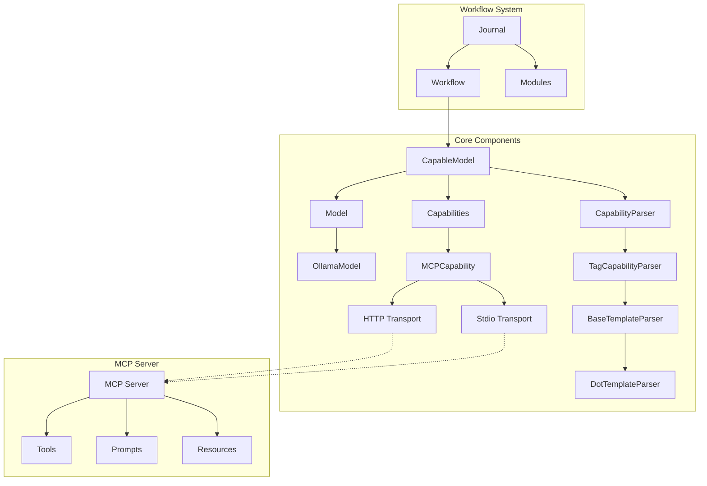
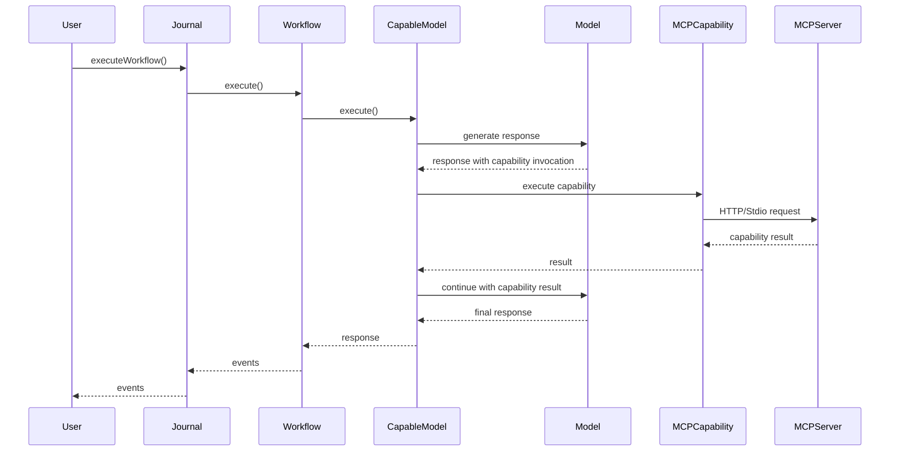

# Ferment AI


A declarative framework for configuring and executing model-based LLM systems with unprecedented clarity and control.

## Introduction

Ferment AI is a powerful framework for configuring and executing model-based systems using a declarative approach. Built with a clean separation between definition and execution, it provides a clear, composable way to define complex model interactions, workflows, tools, and capabilities.

Unlike imperative frameworks, Ferment AI separates declaration from runtime, enabling more maintainable, testable, and extensible LLM systems. The workflow-based architecture with a central journal system simplifies state management and enables features like pausing, resuming, and real-time visibility into model operations.

## Key Features

- **Declarative Configuration** using AWS CDK-style constructs for clear, composable system definitions
- **Real-Time Streaming** of all model interactions for complete transparency
- **Workflow-Based Architecture** with tasks and defined relationships
- **Journal System** that executes workflows and maintains authoritative state
- **Stateless Operation** with serialization/deserialization of the entire system state
- **Capability System** integrated with workflows for model capabilities
- **Model Context Protocol (MCP)** support for connecting to external capability servers
- **Human Intervention** support with cancellation and resumption
- **Type Safety** with Zod validation for inputs and outputs at both compile time and runtime

## Architecture Overview

### Core Architecture

```typescript
// Store the Construct tree
const rootConstruct = new RootConstruct('Root');

// Create a model
const model = new OllamaModel(rootConstruct, 'Model', {
  host: 'localhost:11434',
  modelName: 'llama3.1:8b'
});

// Create an MCP capability
const mcpCapability = new MCPCapability(rootConstruct, 'MCPCapability', {
  transport: {
    type: 'http', // also supports 'stdio'
    uri: 'http://localhost:7000/mcp'
  }
});

// Create a capability parser
const capabilityParser = new TagCapabilityParser(rootConstruct, 'CapabilityParser', {});

// Create a capable model
const capableModel = new CapableModel(rootConstruct, 'CapableModel', {
  model: model,
  capabilities: [mcpCapability],
  capabilityParser
});

// Create a workflow with the capable model as the entry point
const workflow = new Workflow(rootConstruct, 'Workflow', {
  definition: capableModel
});
```



### Workflow Execution

```typescript
// Create a journal and execute the workflow
const journal = new Journal([createCoreConstructsModule()], {
  rootConstruct
});

// Execute the workflow
async function runWorkflow() {
  const workflowName = "Root/Workflow"; // the full path to the Workflow construct
  
  for await (const event of journal.executeWorkflow(workflowName, {
    messages: [
      { role: 'user', content: 'What is the capital of France?' }
    ]
  })) {
    // Handle events (model responses, capability calls, etc.)
    console.log('Event:', event);
  }
}

runWorkflow();
```



### Package Structure

- **@ferment-ai/core-constructs-lib**: Core construct library and task definitions
- **@ferment-ai/core-constructs-runtime**: Runtime implementation for core constructs
- **@ferment-ai/runtime-common**: Common interfaces and utilities for runtime packages, including the workflow compiler
- **@ferment-ai/runtime-in-memory**: In-memory implementation of the Journal
- **@ferment-ai/demo**: Demo application

The core-constructs-lib and core-constructs-runtime packages form a complementary pair:
- **core-constructs-lib** defines the constructs and task definitions (the "what")
- **core-constructs-runtime** implements the runtime behavior of those constructs (the "how")

This separation allows integrators to bring their own implementation, constructs, or both. If you think my core constructs are bad, you can bring your own. The core constructs contain no special privileges; any construct library has the same capability.

# Initial Setup
```bash
git clone https://github.com/ferment-ai/ferment.git
cd ferment

# Install dependencies
npm install

# Build all packages
npx nx run-many -t build

# Build the demo
npx nx build demo

# Run the demo with a specific test case
npx nx serve demo --args="SimpleCall"
npx nx serve demo --args="TestMCPGetCapabilities"
npx nx serve demo --args="TestMCPExecuteCapability"
npx nx serve demo --args="TestCapableModel"
```

### Basic Usage Example

Here's a simple example of creating a workflow with a capable model:

```typescript
import { CapableModel, OllamaModel, MCPCapability, TagCapabilityParser } from '@ferment-ai/core-constructs-lib';
import { Construct, RootConstruct } from 'constructs';
import { createCoreConstructsModule } from '@ferment-ai/core-constructs-runtime';
import { Journal } from '@ferment-ai/runtime-in-memory';
import { Workflow } from '@ferment-ai/runtime-common';

// Create a root construct
const rootConstruct = new RootConstruct('Root');

// Create a model
const model = new OllamaModel(rootConstruct, 'Model', {
  host: 'localhost:11434',
  modelName: 'llama3.1:8b'
});

// Create an MCP capability
const mcpCapability = new MCPCapability(rootConstruct, 'MCPCapability', {
  transport: {
    type: 'http',
    uri: 'http://localhost:7000/mcp'
  }
});

// Create a capability parser
const capabilityParser = new TagCapabilityParser(rootConstruct, 'CapabilityParser', {});

// Create a capable model
const capableModel = new CapableModel(rootConstruct, 'CapableModel', {
  model: model,
  capabilities: [mcpCapability],
  capabilityParser
});

// Create a workflow with the capable model as the entry point
const workflow = new Workflow(rootConstruct, 'Workflow', {
  definition: capableModel
});

// Create a journal and execute the workflow
const journal = new Journal([createCoreConstructsModule()], {
  rootConstruct
});

async function runWorkflow() {
  const workflowName = Object.keys(journal.toSavedState().compileResult.workflows)[0];
  
  for await (const event of journal.executeWorkflow(workflowName, {
    messages: [
      { role: 'user', content: 'What is the capital of France?' }
    ]
  })) {
    console.log('Event:', event);
  }
}

runWorkflow();
```

## User Guides

### For Workflow Definers

As a workflow definer, you'll create LLM workflows using Ferment AI's declarative configuration system.

#### Using Capabilities

```typescript
// Create an MCP capability
const mcpCapability = new MCPCapability(rootConstruct, 'MCPCapability', {
  transport: {
    type: 'http',
    uri: 'http://localhost:7000/mcp'
  }
});

// Create a capability parser
const capabilityParser = new TagCapabilityParser(rootConstruct, 'CapabilityParser', {});

// Create a capable model with access to capabilities
const capableModel = new CapableModel(rootConstruct, 'CapableModel', {
  model: model,
  capabilities: [mcpCapability],
  capabilityParser
});

// Create the workflow
const workflow = new Workflow(rootConstruct, 'CapabilityWorkflow', {
  definition: capableModel
});
```

#### Model Context Protocol (MCP)

The Model Context Protocol (MCP) enables communication with external capability servers:

```typescript
// HTTP transport
const httpMcpCapability = new MCPCapability(rootConstruct, 'HttpMCPCapability', {
  transport: {
    type: 'http',
    uri: 'http://localhost:7000/mcp'
  }
});

// Stdio transport
const stdioMcpCapability = new MCPCapability(rootConstruct, 'StdioMCPCapability', {
  transport: {
    type: 'stdio',
    command: 'npx',
    arguments: ['-y', '@modelcontextprotocol/server-sequential-thinking']
  }
});

// Add capabilities to a capable model
const capableModel = new CapableModel(rootConstruct, 'CapableModel', {
  model: model,
  capabilities: [httpMcpCapability, stdioMcpCapability],
  capabilityParser
});
```

#### Best Practices

- Use descriptive IDs for constructs to make the configuration more readable
- Define clear task relationships to ensure proper workflow execution
- Use the appropriate model for each capability based on its requirements
- Provide detailed prompts to guide model behavior
- Test workflows with simple inputs before scaling to complex scenarios
- Use the TagCapabilityParser to format prompts with available capabilities
- Handle capability naming conflicts appropriately

### For Workflow Integrators

As a workflow integrator, you'll incorporate Ferment AI workflows into your applications.

#### Integrating Workflows

```typescript
// Create a journal with the necessary modules
const journal = new Journal([createCoreConstructsModule()], {
  rootConstruct
});

// Execute a workflow
async function executeWorkflow(input) {
  const workflowName = 'YourWorkflowName';
  
  for await (const event of journal.executeWorkflow(workflowName, input)) {
    // Process events (agent responses, tool calls, etc.)
    handleEvent(event);
  }
  
  // Get the final state
  const finalState = journal.toSavedState();
  return finalState;
}

// Save and restore state
function saveWorkflowState() {
  const state = journal.toSavedState();
  localStorage.setItem('workflowState', JSON.stringify(state));
}

function restoreWorkflowState() {
  const stateJson = localStorage.getItem('workflowState');
  if (stateJson) {
    const state = JSON.parse(stateJson);
    return Journal.fromSavedState(state, [createCoreConstructsModule()]);
  }
  return null;
}
```

#### Error Handling

```typescript
try {
  for await (const event of journal.executeWorkflow(workflowName, input)) {
    if (event.type === 'task_error') {
      // Handle error events
      console.error('Workflow error:', event.error);
      // Implement recovery strategy
    } else {
      // Process normal events
      handleEvent(event);
    }
  }
} catch (error) {
  // Handle unexpected errors
  console.error('Unexpected error:', error);
  // Implement fallback strategy
}
```

#### Performance Considerations

- Implement caching for frequently used workflows
- Use efficient serialization formats for state storage

### For L1 Construct Developers

As an L1 construct developer, you'll create new fundamental constructs for Ferment AI by creating your own "-lib" and "-runtime" packages that follow the same pattern as the `core-construct-*` packages.

#### Creating a New L1 Construct

0. Add Zod and @ferment-ai as peer dependencies

Because you're creating a library that other binary applications are going to use, you want to enable the end developer to bring their own version of Zod and ferment-ai.

Note that you probably do not want to include `runtime-in-memory` as a dependency because you do not necessarily know how the end application is going to be orchestrated.

```typescript
npm install --save-peer @ferment-ai/runtime-common zod
```

1. Define a task definition in your "-lib" package:

```typescript
// In your-lib/src/lib/task-defs.ts
import { z } from 'zod';
import { TaskDef } from '@ferment-ai/runtime-common';

const MyCustomInputSchema = z.object({
  param1: z.string(),
  param2: z.number().optional()
});

const MyCustomOutputSchema = z.object({
  result: z.string()
});

export const MY_CUSTOM_TASK_DEF: TaskDef<typeof MyCustomInputSchema, typeof MyCustomOutputSchema> = {
  taskDefId: 'YourLib::MyCustomTaskDef',
  inputType: MyCustomInputSchema,
  outputType: MyCustomOutputSchema
};
```

2. Create a construct class in your "-lib" package:

```typescript
// In your-lib/src/lib/my-custom-construct.ts
import { Construct } from 'constructs';
import { WorkflowTask } from '@ferment-ai/runtime-common';
import { MY_CUSTOM_TASK_DEF } from './task-defs';

export interface MyCustomConstructProps {
  name: string;
  description: string;
  // Other properties
}

export class MyCustomConstruct extends WorkflowTask<typeof MY_CUSTOM_TASK_DEF.inputType, typeof MY_CUSTOM_TASK_DEF.outputType> {
  public readonly props: MyCustomConstructProps;
  
  public override readonly taskDef = MY_CUSTOM_TASK_DEF;
  
  constructor(scope: Construct, id: string, props: MyCustomConstructProps) {
    super(scope, id, {});
    this.props = props;
    // Initialize other properties
  }
  
  // Add methods as needed. Setters for props, etc.
}
```

3. Implement the task function in your "-runtime" package:

```typescript
// In your-runtime/src/lib/my-custom-task.ts
import { MyCustomConstruct, MY_CUSTOM_TASK_DEF } from 'your-lib';
import { TaskCtx } from '@ferment-ai/runtime-common';

export function createMyCustomTaskImpl(construct: MyCustomConstruct): TaskImpl<typeof MY_CUSTOM_TASK_DEF.inputType, typeof MY_CUSTOM_TASK_DEF.outputType> {
  return {
    def: MY_CUSTOM_TASK_DEF,
    nodePath: construct.node.path,
    // for a generator function (this should be your default):
    execute: async function* (ctx: TaskCtx<typeof MY_CUSTOM_TASK_DEF.inputType, typeof MY_CUSTOM_TASK_DEF.outputType>) {
      // return type: TaskCallResult
    }

    // or, if you do not need to call other tools, and wish to use a promise:
    execute: convertPromiseToGenerator(async (ctx: TaskCtx<typeof MY_CUSTOM_TASK_DEF.inputType, typeof MY_CUSTOM_TASK_DEF.outputType>) => {
      // return type: TaskCallResult
    })
  }
}
```

4. Create a module in your "-runtime" package:

```typescript
// In your-runtime/src/lib/module.ts
import { Construct } from 'constructs';
import { Module } from '@ferment-ai/runtime-common';
import { MyCustomConstruct } from 'your-lib';
import { executeMyCustomTask } from './my-custom-task';

export function createYourLibModule(): Module {
  return (construct: Construct) => {
    if (construct instanceof WorkflowTask) {
      switch(construct.taskDef.taskDefId) {
        // we cast the constructs here instead of using instanceof so that reimplementors of the `-lib` works
        case INVOKE_MODEL_TASK_DEF.taskDefId:
          return createMyCustomTaskImpl(construct as MyCustomConstruct);
        default:
          //fallthrough
      }
    }
    
    // No task implementation for this construct from this module
    return undefined;
  };
}
```

#### Understanding the Module System

The module system maps constructs to task implementations, allowing for extensibility. Each module is responsible for a specific collection of constructs. The journal uses modules to find the appropriate task implementation for a given construct.

### For L2/L3 Construct Developers

As an L2/L3 construct developer, you'll create higher-level, domain-specific constructs by composing L1 constructs.

You should still put these in a package named "-lib", but you do not need to create a "-runtime" package (no Module or Task work needed).

You can tell when you're writing a L1 construct because it `extends WorkflowTask<...>`. These constructs use custom logic at runtime, which needs to be implemented in a corresponding runtime library. If you're just composing together pre-existing constructs in a reusable way, you're writing a L2/L3 construct, and no runtime piece is necessary.

#### Creating an L2/L3 Construct

```typescript
// Example of an L2 construct for a RAG system
export class RAGSystem extends Construct {
  public readonly vectorStore: VectorStore;
  public readonly retriever: Retriever;
  public readonly capableModel: CapableModel;
  
  constructor(scope: Construct, id: string, props: RAGSystemProps) {
    super(scope, id, {});
    
    // Create the vector store
    this.vectorStore = new VectorStore(this, 'VectorStore', {
      documents: props.documents,
      embeddingModel: props.embeddingModel
    });
    
    // Create the retriever
    this.retriever = new Retriever(this, 'Retriever', {
      vectorStore: this.vectorStore,
      topK: props.topK ?? 5
    });
    
    // Create the capability parser
    const capabilityParser = new TagCapabilityParser(this, 'CapabilityParser', {});
    
    // Create the retriever capability
    const retrieverCapability = new CustomCapability(this, 'RetrieverCapability', {
      retriever: this.retriever
    });
    
    // Create the capable model with access to the retriever
    this.capableModel = new CapableModel(this, 'CapableModel', {
      model: props.model,
      capabilities: [retrieverCapability],
      capabilityParser
    });
  }
}
```

#### Best Practices for L2/L3 Constructs

- Focus on solving specific use cases or domains
- Provide sensible defaults while allowing customization
- Expose a simple, intuitive API that hides complexity
- Document the construct thoroughly with examples
- Include helper methods for common operations
- Ensure proper validation of inputs
- Follow consistent naming conventions

## API Reference

### Core Constructs

- **WorkflowTask**: Base class for all tasks in a workflow
- **BaseModel**: Base class for model implementations
- **OllamaModel**: Implementation of the Ollama LLM provider
- **BaseCapability**: Base class for capability implementations
- **MCPCapability**: Implementation of the Model Context Protocol capability
- **BaseCapabilityParser**: Base class for capability parser implementations
- **TagCapabilityParser**: Implementation of the tag-based capability parser
- **BaseTemplateParser**: Base class for template parser implementations
- **DotTemplateParser**: Implementation of the dot template engine parser
- **CapableModel**: Class that combines models with capabilities

### Workflow and Task System

- **Workflow**: A sequence of tasks with defined relationships
- **TaskDef**: Interface for task definitions
- **TaskImpl**: Interface for task implementations
- **TaskCtx**: Interface for task context
- **TaskCallRequest**: Interface for task call requests
- **TaskCallResult**: Interface for task call results

### Journal System

- **Journal**: Central executor for workflows
- **executeWorkflow**: Method to execute a workflow
- **toSavedState**: Method to serialize the journal state
- **fromSavedState**: Method to deserialize the journal state
- **addModule**: Method to add a module to the journal

### Module System

- **Module**: Type for modules that map constructs to task implementations
- **createCoreConstructsModule**: Function to create a module for core constructs
- **TaskImplMap**: Type for a map of node paths to task implementations

## Contributing

### Development Setup

```bash
# Clone the repository
git clone https://github.com/ferment-ai/ferment.git
cd ferment

# Install dependencies
npm install

# Build the packages
npm run build

# Run tests
npm test
```

### Coding Standards

- Follow TypeScript best practices
- Use Zod for schema validation
- Document all public APIs
- Write tests for new features
- Follow the existing architecture patterns

### Pull Request Process

1. Fork the repository
2. Create a feature branch
3. Make your changes
4. Write tests for your changes
5. Ensure all tests pass
6. Submit a pull request

## License

This project is licensed under the MIT License - see the LICENSE file for details.

