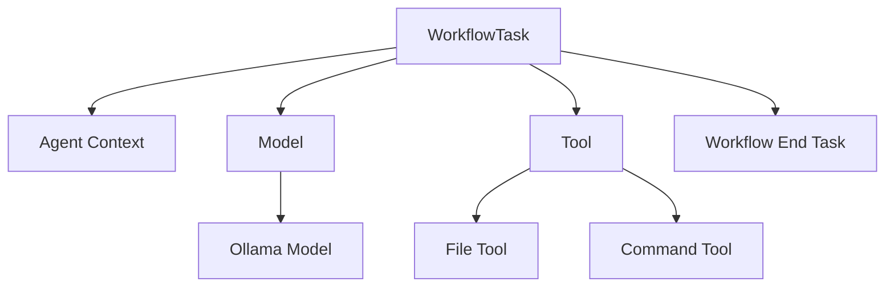
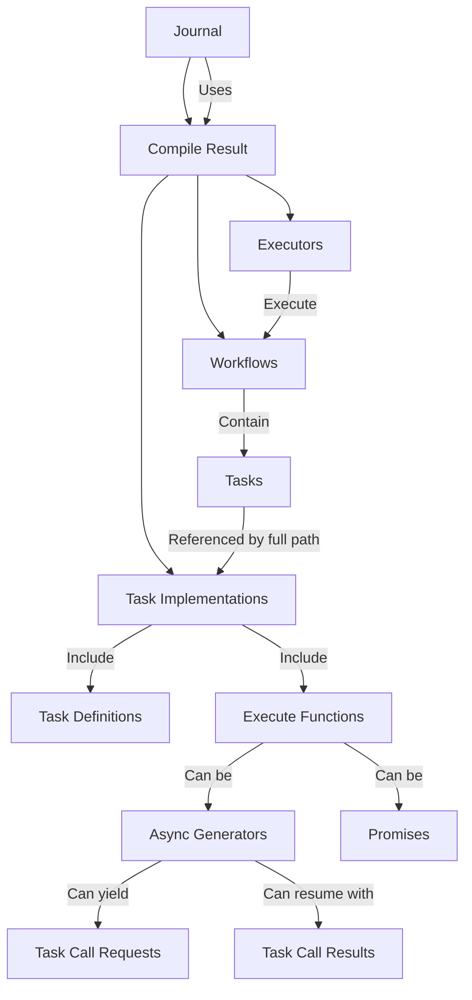

# Ferment AI


A declarative framework for configuring and executing multi-agent LLM systems with unprecedented clarity and control.

## Introduction

Ferment AI is a powerful framework for configuring and executing multi-agent systems using a declarative approach. Built with a clean separation between definition and execution, it provides a clear, composable way to define complex agent interactions, workflows, and tools.

Unlike imperative frameworks, Ferment AI separates declaration from runtime, enabling more maintainable, testable, and extensible agent systems. The workflow-based architecture with a central journal system simplifies state management and enables features like pausing, resuming, and real-time visibility into agent operations.

## Key Features

- **Declarative Configuration** using AWS CDK-style constructs for clear, composable system definitions
- **Real-Time Streaming** of all agent interactions for complete transparency
- **Workflow-Based Architecture** with tasks and defined relationships
- **Journal System** that executes workflows and maintains authoritative state
- **Stateless Operation** with serialization/deserialization of the entire system state
- **Tool System** integrated with workflows for agent capabilities
- **Human Intervention** support with cancellation and resumption
- **Type Safety** with Zod validation for inputs and outputs at both compile time and runtime

## Architecture Overview

### Task-Based Architecture

Ferment AI is built around the concept of tasks, which are units of work in a workflow. Each task has a task definition that specifies its input and output types using Zod schemas.



### Workflow-Based Architecture



### Package Structure

- **@ferment-ai/core-constructs-lib**: Core construct library and task definitions
- **@ferment-ai/core-constructs-runtime**: Runtime implementation for core constructs
- **@ferment-ai/runtime-common**: Common interfaces and utilities for runtime packages, including the workflow compiler.
- **@ferment-ai/runtime-in-memory**: In-memory implementation of the Journal
- **@ferment-ai/demo**: Demo application

The core-constructs-lib and core-constructs-runtime packages form a complementary pair:
- **core-constructs-lib** defines the constructs and task definitions (the "what")
- **core-constructs-runtime** implements the runtime behavior of those constructs (the "how")

This separation allows integrators to bring their own implementation, constructs, or both. If you think my core constructs are bad, you can bring your own. The core constructs contain no special privileges; any construct library has the same capability.

# Initial Setup
```bash
git clone https://github.com/ferment-ai/ferment.git
cd ferment

# Install dependencies
npm install

# Build all packages
npx nx run-many -t build

# Build the demo
npx nx build demo

# Run the demo
npx nx serve demo --args="SimpleCall" # or any of the other demos in LOOKUP in packages/demo/src/main.ts
```

### Basic Usage Example

Here's a simple example of creating a workflow with a single agent:

```typescript
import { AgentContext, OllamaModel } from '@ferment-ai/core-constructs-lib';
import { Construct, RootConstruct } from 'constructs';
import { createCoreConstructsModule } from '@ferment-ai/core-constructs-runtime';
import { Journal } from '@ferment-ai/runtime-in-memory';
import { Workflow } from '@ferment-ai/runtime-common';

// Create a root construct
const rootConstruct = new RootConstruct('Root');

// Create a model and agent context
const model = new OllamaModel(rootConstruct, 'Model', {
  host: 'localhost:11434',
  modelName: 'llama3.1:8b'
});

const agent = new AgentContext(rootConstruct, 'Agent', {
  initialMessages: [
    {
      role: 'user',
      content: 'Hello, how can you help me today?'
    }
  ],
  model: model
});

// Create a workflow with the agent as the entry point
const workflow = new Workflow(rootConstruct, 'Workflow', {
  definition: agent
});

// Create a journal and execute the workflow
const journal = new Journal([createCoreConstructsModule()], {
  rootConstruct
});

async function runWorkflow() {
  const workflowName = Object.keys(journal.toSavedState().compileResult.workflows)[0];
  
  for await (const event of journal.executeWorkflow(workflowName, {
    messages: [
      { role: 'user', content: 'What is the capital of France?' }
    ]
  })) {
    console.log('Event:', event);
  }
}

runWorkflow();
```

## User Guides

### For Workflow Definers

As a workflow definer, you'll create LLM workflows using Ferment AI's declarative configuration system.

#### Using Tools

```typescript
// Create a file tool
const fileTool = new FileTool(rootConstruct, 'FileTool', {
  name: 'file',
  description: 'Read and write files on the filesystem'
});

// Create a command tool
const commandTool = new CommandTool(rootConstruct, 'CommandTool', {
  name: 'command',
  description: 'Execute shell commands'
});

// Create an agent with access to tools
const agent = new AgentContext(rootConstruct, 'Agent', {
  model: model,
  initialMessages: [
    {
      role: 'system',
      content: "You are a helpful assistant with access to file and command tools."
    }
  ],
  tools: [fileTool, commandTool]
});

// Create the workflow
const workflow = new Workflow(rootConstruct, 'ToolWorkflow', {
  definition: agent
});
```

#### Multi-Agent Systems (WIP)

Multi-agent system support is currently under active development. The API for defining agent interactions is evolving and will be documented in future releases.

#### Best Practices

- Use descriptive IDs for constructs to make the configuration more readable
- Define clear task relationships to ensure proper workflow execution
- Use the appropriate model for each agent based on its responsibilities
- Provide detailed prompts to guide agent behavior
- Test workflows with simple inputs before scaling to complex scenarios

### For Workflow Integrators

As a workflow integrator, you'll incorporate Ferment AI workflows into your applications.

#### Integrating Workflows

```typescript
// Create a journal with the necessary modules
const journal = new Journal([createCoreConstructsModule()], {
  rootConstruct
});

// Execute a workflow
async function executeWorkflow(input) {
  const workflowName = 'YourWorkflowName';
  
  for await (const event of journal.executeWorkflow(workflowName, input)) {
    // Process events (agent responses, tool calls, etc.)
    handleEvent(event);
  }
  
  // Get the final state
  const finalState = journal.toSavedState();
  return finalState;
}

// Save and restore state
function saveWorkflowState() {
  const state = journal.toSavedState();
  localStorage.setItem('workflowState', JSON.stringify(state));
}

function restoreWorkflowState() {
  const stateJson = localStorage.getItem('workflowState');
  if (stateJson) {
    const state = JSON.parse(stateJson);
    return Journal.fromSavedState(state, [createCoreConstructsModule()]);
  }
  return null;
}
```

#### Error Handling

```typescript
try {
  for await (const event of journal.executeWorkflow(workflowName, input)) {
    if (event.type === 'task_error') {
      // Handle error events
      console.error('Workflow error:', event.error);
      // Implement recovery strategy
    } else {
      // Process normal events
      handleEvent(event);
    }
  }
} catch (error) {
  // Handle unexpected errors
  console.error('Unexpected error:', error);
  // Implement fallback strategy
}
```

#### Performance Considerations

- Implement caching for frequently used workflows
- Use efficient serialization formats for state storage

### For L1 Construct Developers

As an L1 construct developer, you'll create new fundamental constructs for Ferment AI by creating your own "-lib" and "-runtime" packages that follow the same pattern as the `core-construct-*` packages.

#### Creating a New L1 Construct

0. Add Zod and @ferment-ai as peer dependencies

Because you're creating a library that other binary applications are going to use, you want to enable the end developer to bring their own version of Zod and ferment-ai.

Note that you probably do not want to include `runtime-in-memory` as a dependency because you do not necessarily know how the end application is going to be orchestrated.

```typescript
npm install --save-peer @ferment-ai/runtime-common zod
```

1. Define a task definition in your "-lib" package:

```typescript
// In your-lib/src/lib/task-defs.ts
import { z } from 'zod';
import { TaskDef } from '@ferment-ai/runtime-common';

export const MY_CUSTOM_TASK_DEF: TaskDef<typeof MyCustomInputSchema, typeof MyCustomOutputSchema> = {
  taskDefId: 'YourLib::MyCustomTaskDef',
  inputType: z.object({
    param1: z.string(),
    param2: z.number().optional()
  }),
  outputType: z.object({
    result: z.string()
  })
};
```

2. Create a construct class in your "-lib" package:

```typescript
// In your-lib/src/lib/my-custom-construct.ts
import { Construct } from 'constructs';
import { WorkflowTask } from '@ferment-ai/runtime-common';
import { MY_CUSTOM_TASK_DEF } from './task-defs';
import { z } from 'zod';

export interface MyCustomConstructProps {
  name: string;
  description: string;
  // Other properties
}

export class MyCustomConstruct extends WorkflowTask<typeof MY_CUSTOM_TASK_DEF.inputType, typeof MY_CUSTOM_TASK_DEF.outputType> {
  public readonly props: MyCustomConstructProps;
  
  public override readonly taskDef = MY_CUSTOM_TASK_DEF;
  
  constructor(scope: Construct, id: string, props: MyCustomConstructProps) {
    super(scope, id, {});
    this.props = props;
    // Initialize other properties
  }
  
  // Add methods as needed
}
```

3. Implement the task function in your "-runtime" package:

```typescript
// In your-runtime/src/lib/my-custom-task.ts
import { MY_CUSTOM_TASK_DEF } from 'your-lib';
import { TaskCtx } from '@ferment-ai/runtime-common';

export async function* executeMyCustomTask(
  ctx: TaskCtx<typeof MY_CUSTOM_TASK_DEF.inputType, typeof MY_CUSTOM_TASK_DEF.outputType>
) {
  const { param1, param2 } = ctx.input;
  
  // Implement task logic
  const result = `Processed ${param1} with ${param2 ?? 'default'}`;
  
  return { result };
}
```

4. Create a module in your "-runtime" package:

```typescript
// In your-runtime/src/lib/module.ts
import { Construct } from 'constructs';
import { Module } from '@ferment-ai/runtime-common';
import { MyCustomConstruct } from 'your-lib';
import { executeMyCustomTask } from './my-custom-task';

export function createYourLibModule(): Module {
  return (construct: Construct) => {
    if (construct instanceof MyCustomConstruct) {
      return {
        def: construct.taskDef,
        nodePath: construct.node.path,
        execute: executeMyCustomTask
      };
    }
    
    // No task implementation for this construct from this module
    return undefined;
  };
}
```

#### Understanding the Module System

The module system maps constructs to task implementations, allowing for extensibility. Each module is responsible for a specific collection of constructs. The journal uses modules to find the appropriate task implementation for a given construct.

### For L2/L3 Construct Developers

As an L2/L3 construct developer, you'll create higher-level, domain-specific constructs by composing L1 constructs.

You should still put these in a package named "-lib", but you do not need to create a "-runtime" package (no Module or Task work needed).

You can tell when you're writing a L1 construct because it `extends WorkflowTask<...>`. These constructs use custom logic at runtime, which needs to be implemented in a corresponding runtime library. If you're just composing together pre-existing constructs in a reusable way, you're writing a L2/L3 construct, and no runtime piece is necessary.

#### Creating an L2/L3 Construct

```typescript
// Example of an L2 construct for a RAG system
export class RAGSystem extends Construct {
  public readonly vectorStore: VectorStore;
  public readonly retriever: Retriever;
  public readonly agent: AgentContext;
  
  constructor(scope: Construct, id: string, props: RAGSystemProps) {
    super(scope, id, {});
    
    // Create the vector store
    this.vectorStore = new VectorStore(this, 'VectorStore', {
      documents: props.documents,
      embeddingModel: props.embeddingModel
    });
    
    // Create the retriever
    this.retriever = new Retriever(this, 'Retriever', {
      vectorStore: this.vectorStore,
      topK: props.topK ?? 5
    });
    
    // Create the agent with access to the retriever
    this.agent = new AgentContext(this, 'Agent', {
      model: props.model,
      initialMessages: props.initialMessages,
      tools: [this.retriever]
    });
  }
}
```

#### Best Practices for L2/L3 Constructs

- Focus on solving specific use cases or domains
- Provide sensible defaults while allowing customization
- Expose a simple, intuitive API that hides complexity
- Document the construct thoroughly with examples
- Include helper methods for common operations
- Ensure proper validation of inputs
- Follow consistent naming conventions

## API Reference

### Core Constructs

- **WorkflowTask**: Base class for all tasks in a workflow
- **AgentContext**: Environment for a single agent
- **OllamaModel**: Implementation of the Ollama LLM provider
- **Tool**: Base class for tools that can be used by agents
- **WorkflowEndTask**: A specialized task that represents the end of a workflow

### Workflow and Task System

- **Workflow**: A sequence of tasks with defined relationships
- **TaskDef**: Interface for task definitions
- **TaskImpl**: Interface for task implementations

### Journal System

- **Journal**: Central executor for workflows
- **executeWorkflow**: Method to execute a workflow
- **toSavedState**: Method to serialize the journal state
- **fromSavedState**: Method to deserialize the journal state

### Module System

- **Module**: Type for modules that map constructs to task implementations
- **createCoreConstructsModule**: Function to create a module for core constructs

## Contributing

### Development Setup

```bash
# Clone the repository
git clone https://github.com/ferment-ai/ferment.git
cd ferment

# Install dependencies
npm install

# Build the packages
npm run build

# Run tests
npm test
```

### Coding Standards

- Follow TypeScript best practices
- Use Zod for schema validation
- Document all public APIs
- Write tests for new features
- Follow the existing architecture patterns

### Pull Request Process

1. Fork the repository
2. Create a feature branch
3. Make your changes
4. Write tests for your changes
5. Ensure all tests pass
6. Submit a pull request

## License

This project is licensed under the MIT License - see the LICENSE file for details.

## API Reference

### Core Constructs

- **WorkflowTask**: Base class for all tasks in a workflow
- **AgentContext**: Environment for a single agent
- **OllamaModel**: Implementation of the Ollama LLM provider
- **Tool**: Base class for tools that can be used by agents
- **WorkflowEndTask**: A specialized task that represents the end of a workflow

### Workflow and Task System

- **Workflow**: A sequence of tasks with defined relationships
- **TaskDef**: Interface for task definitions
- **TaskImpl**: Interface for task implementations

### Journal System

- **Journal**: Central executor for workflows
- **executeWorkflow**: Method to execute a workflow
- **toSavedState**: Method to serialize the journal state
- **fromSavedState**: Method to deserialize the journal state

### Module System

- **Module**: Type for modules that map constructs to task implementations
- **createCoreConstructsModule**: Function to create a module for core constructs
