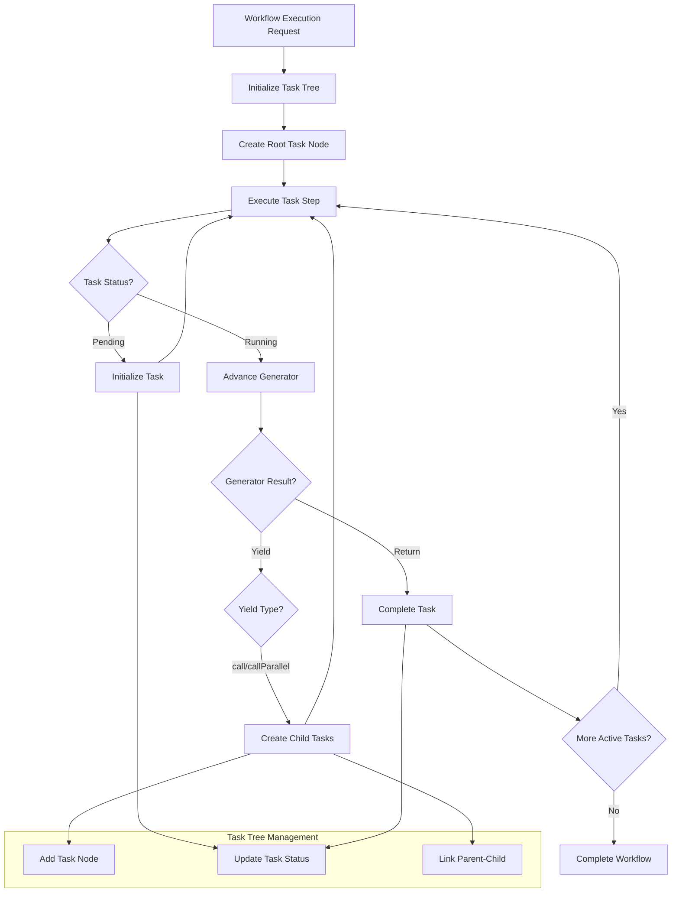

# Compiler Rewrite Plan

## Overview

We are completely rewriting the compiler with a purely functional approach. The key changes include:

1. Replacing the task "stack" with a task "tree" to allow each task to fork multiple subtasks
2. Introducing a "taskExecutionId" to uniquely refer to specific running tasks
3. Eliminating the concept of "call" and only having "callParallel" (old call will be proxied to callParallel with a single item)
4. Using purely functional programming for implementation (no classes except for Error extensions)
5. Maintaining the existing AsyncGenerator contract for TaskImpls and Journal
6. Executing multiple tasks in parallel and combining their outputs in a single AsyncGenerator stream in real time

## Core Entities

### 1. TaskExecutionId

```typescript
// A unique identifier for a specific running task instance
export type TaskExecutionId = string;

// Helper function to generate unique task execution IDs
export function generateTaskExecutionId(): TaskExecutionId {
  return `task_${Date.now()}_${Math.random().toString(36).substring(2, 9)}`;
}
```

### 2. TaskNode (Internal)

```typescript
// Represents a node in the task execution tree
export interface TaskNode {
  executionId: TaskExecutionId;
  nodePath: string;
  taskDefId: string;
  input: any;
  status: 'pending' | 'running' | 'completed' | 'error';
  output?: any;
  error?: WorkflowError;
  parentId?: TaskExecutionId;
  childIds: TaskExecutionId[];
  generator?: AsyncGenerator<any, any, any>; // The task's generator if running
}
```

### 3. TaskTree (Internal)

```typescript
// The task execution tree
export class TaskTree {
  private nodes: Map<TaskExecutionId, TaskNode> = new Map();
  
  // Add a new task node to the tree
  addNode(node: TaskNode): void {
    this.nodes.set(node.executionId, node);
  }
  
  // Update an existing task node in the tree
  updateNode(executionId: TaskExecutionId, updates: Partial<TaskNode>): void {
    const existingNode = this.nodes.get(executionId);
    if (!existingNode) {
      throw new Error(`Task node with execution ID ${executionId} not found`);
    }
    this.nodes.set(executionId, { ...existingNode, ...updates });
  }
  
  // Add a child to a parent node
  addChild(parentId: TaskExecutionId, childId: TaskExecutionId): void {
    const parentNode = this.nodes.get(parentId);
    if (!parentNode) {
      throw new Error(`Parent task node with execution ID ${parentId} not found`);
    }
    parentNode.childIds.push(childId);
  }
  
  // Get a node by execution ID
  getNode(executionId: TaskExecutionId): TaskNode | undefined {
    return this.nodes.get(executionId);
  }
  
  // Get all child nodes for a parent
  getChildren(parentId: TaskExecutionId): TaskNode[] {
    const parent = this.nodes.get(parentId);
    if (!parent) return [];
    return parent.childIds
      .map(id => this.nodes.get(id))
      .filter((node): node is TaskNode => node !== undefined);
  }
  
  // Get all nodes
  getAllNodes(): TaskNode[] {
    return Array.from(this.nodes.values());
  }
  
  // Clone the tree (for immutability in functional operations)
  clone(): TaskTree {
    const newTree = new TaskTree();
    for (const [id, node] of this.nodes.entries()) {
      newTree.nodes.set(id, { ...node });
    }
    return newTree;
  }
}
```

### 4. TaskMessage Types

```typescript
// Base interface for all task messages
export interface TaskMessage {
  type: string;
  taskExecutionId: TaskExecutionId;
}

// Request to call a single task
export interface TaskCallRequest extends TaskMessage {
  type: 'call';
  taskDefId: string;
  nodePath: string;
  input: any;
}

// Request to call multiple tasks in parallel
export interface TaskCallParallelRequest extends TaskMessage {
  type: 'callParallel';
  calls: Array<{
    taskDefId: string;
    nodePath: string;
    input: any;
  }>;
}

// Result of a task execution
export interface TaskCallResult extends TaskMessage {
  type: 'result';
  taskDefId: string;
  nodePath: string;
  input: any;
  output: any;
}

// Error from a task execution
export interface TaskCallError extends TaskMessage {
  type: 'error';
  taskDefId: string;
  nodePath: string;
  input: any;
  error: {
    message: string;
    details: WorkflowError | Error | unknown;
  };
}
```

### 5. TaskImpl

```typescript
// Task implementation with definition and execution function
export interface TaskImpl<I extends z.ZodTypeAny, O extends z.ZodTypeAny> {
  def: TaskDef<I, O>;
  nodePath: string;
  execute: TaskExecuteFunction<I, O>;
}

// Task execution function type
export type TaskExecuteFunction<I extends z.ZodTypeAny, O extends z.ZodTypeAny> =
  (ctx: TaskCtx<I, O>) => AsyncGenerator<TaskCallRequest | TaskCallParallelRequest, TaskCallResult | TaskCallError, TaskCallResult | TaskCallError>;

// A map of node paths to task implementations
export type TaskImplMap = Record<string, TaskImpl<z.ZodTypeAny, z.ZodTypeAny>>;
```

### 6. TaskCtx

```typescript
// Task context provided to a task during execution
export interface TaskCtx<I extends z.ZodTypeAny, O extends z.ZodTypeAny> {
  taskExecutionId: TaskExecutionId;
  taskDefId: string;
  nodePath: string;
  input: z.infer<I>;
  output: z.infer<O>;
  canCallTasks: { [nodePath: string]: TaskDef<z.ZodTypeAny, z.ZodTypeAny> };
  nodePathToConstruct: { [nodePath: string]: Construct };
}
```

### 7. WorkflowExecutionState

```typescript
// The complete state of a workflow execution
export interface WorkflowExecutionState {
  workflowId: string;
  taskTree: TaskTree;
  activeTaskIds: TaskExecutionId[];
  completedTaskIds: TaskExecutionId[];
  rootTaskId?: TaskExecutionId;
}
```

### 8. WorkflowLogEvent (Extended)

```typescript
// Workflow log event types
export type WorkflowLogEventType =
  'task_start' | 'task_complete' | 'task_error' |
  'workflow_start' | 'workflow_complete' | 'workflow_error' |
  'parallel_tasks_start' | 'parallel_tasks_complete' |
  'task_tree_updated'; // New event type

// A workflow execution log event
export interface WorkflowLogEvent {
  timestamp: number;
  type: WorkflowLogEventType;
  nodePath?: string;
  taskDefId?: string;
  taskExecutionId?: TaskExecutionId;
  input?: any;
  output?: any;
  error?: WorkflowError | Error;
  taskTree?: TaskTree; // For task_tree_updated events
}
```

## Core Functions

### 1. validateWithZod

```typescript
function validateWithZod<T>(
  schema: z.ZodType<T>, 
  input: any, 
  nodePath: string, 
  direction: 'input' | 'output'
): T {
  try {
    return schema.parse(input);
  } catch (error) {
    if (error instanceof z.ZodError) {
      throw new Error(`Invalid ${direction} for task ${nodePath}: ${error.message}`);
    }
    throw error;
  }
}
```

### 2. createTaskContext

```typescript
function createTaskContext<I extends z.ZodTypeAny, O extends z.ZodTypeAny>(
  executionId: TaskExecutionId,
  nodePath: string,
  input: any,
  taskImpl: TaskImpl<I, O>,
  workflowDef: WorkflowDefinition,
  taskImpls: TaskImplMap,
  nodePathToConstruct: { [nodePath: string]: Construct }
): TaskCtx<I, O> {
  const taskDef = workflowDef.tasks[nodePath];
  
  // Create the task context
  const taskCtx: TaskCtx<I, O> = {
    taskExecutionId: executionId,
    taskDefId: taskImpl.def.taskDefId,
    nodePath,
    input,
    output: undefined as any,
    canCallTasks: {},
    nodePathToConstruct,
  };
  
  // Populate canCallTasks map
  for (const toolNodePath of taskDef.reachableTasks) {
    if (taskImpls[toolNodePath]) {
      taskCtx.canCallTasks[toolNodePath] = taskImpls[toolNodePath].def;
    }
  }
  
  return taskCtx;
}
```

### 3. executeTaskStep

```typescript
async function executeTaskStep(
  executionId: TaskExecutionId,
  state: WorkflowExecutionState,
  workflowDef: WorkflowDefinition,
  taskImpls: TaskImplMap,
  nodePathToConstruct: { [nodePath: string]: Construct }
): Promise<[WorkflowExecutionState, TaskStepResult]> {
  const node = state.taskTree.getNode(executionId);
  if (!node) {
    throw new Error(`Task node with execution ID ${executionId} not found`);
  }
  
  const { nodePath, input } = node;
  const taskImpl = taskImpls[nodePath];
  
  try {
    // Initialize generator if needed
    if (node.status === 'pending') {
      // Create task context
      const taskCtx = createTaskContext(
        executionId,
        nodePath,
        input,
        taskImpl,
        workflowDef,
        taskImpls,
        nodePathToConstruct
      );
      
      // Initialize generator
      const generator = taskImpl.execute(taskCtx);
      
      // Update node status to running
      const newState = { ...state };
      newState.taskTree.updateNode(executionId, { 
        status: 'running',
        generator
      });
      
      return [newState, { type: 'continue', executionId }];
    }
    
    // Advance generator
    const generator = node.generator;
    if (!generator) {
      throw new Error(`Task node with execution ID ${executionId} has no generator`);
    }
    
    const { value, done } = await generator.next(input);
    
    // Handle generator completion
    if (done) {
      // Handle different result types
      if (value && value.type === 'result') {
        // Validate output
        const validatedOutput = validateWithZod(
          taskImpl.def.outputType,
          value.output,
          nodePath,
          'output'
        );
        
        // Update node with result
        const newState = { ...state };
        newState.taskTree.updateNode(executionId, { 
          status: 'completed',
          output: validatedOutput
        });
        newState.activeTaskIds = newState.activeTaskIds.filter(id => id !== executionId);
        newState.completedTaskIds.push(executionId);
        
        return [newState, { 
          type: 'complete', 
          result: { 
            ...value, 
            output: validatedOutput,
            taskExecutionId: executionId
          } as TaskCallResult 
        }];
      } else if (value && value.type === 'error') {
        // Update node with error
        const newState = { ...state };
        newState.taskTree.updateNode(executionId, { 
          status: 'error',
          error: value.error.details
        });
        newState.activeTaskIds = newState.activeTaskIds.filter(id => id !== executionId);
        newState.completedTaskIds.push(executionId);
        
        return [newState, { 
          type: 'complete', 
          result: { 
            ...value,
            taskExecutionId: executionId
          } as TaskCallError 
        }];
      }
      
      // Default case (should not happen with proper typing)
      throw new Error(`Unexpected result type from task ${nodePath}: ${value?.type}`);
    }
    
    // Handle generator yield
    if (value && value.type === 'call') {
      // Convert 'call' to 'callParallel' with a single item
      const callParallelValue = {
        type: 'callParallel',
        taskExecutionId: value.taskExecutionId,
        calls: [{
          taskDefId: value.taskDefId,
          nodePath: value.nodePath,
          input: value.input
        }]
      };
      
      // Process as callParallel
      return handleCallParallel(executionId, callParallelValue, state, taskImpls);
    } else if (value && value.type === 'callParallel') {
      return handleCallParallel(executionId, value, state, taskImpls);
    }
    
    // Default case (continue)
    return [state, { type: 'continue', executionId }];
  } catch (error) {
    // Create a WorkflowError if not already one
    const workflowError = error instanceof WorkflowError
      ? error
      : new WorkflowError(
        error instanceof Error ? error.message : 'Unknown error',
        { originalError: error instanceof Error ? error : undefined }
      );
    
    // Add current task to the call stack
    workflowError.addFrame({
      taskDefId: taskImpl.def.taskDefId,
      nodePath,
      input: node.input,
      construct: nodePathToConstruct[nodePath] ? {
        id: nodePathToConstruct[nodePath].node.id,
        path: nodePathToConstruct[nodePath].node.path
      } : undefined
    });
    
    // Update node with error
    const newState = { ...state };
    newState.taskTree.updateNode(executionId, { 
      status: 'error',
      error: workflowError
    });
    newState.activeTaskIds = newState.activeTaskIds.filter(id => id !== executionId);
    newState.completedTaskIds.push(executionId);
    
    // Create TaskCallError
    const taskError: TaskCallError = {
      type: 'error',
      taskExecutionId: executionId,
      taskDefId: taskImpl.def.taskDefId,
      nodePath,
      input: node.input,
      error: {
        message: workflowError.message,
        details: workflowError
      }
    };
    
    return [newState, { type: 'complete', result: taskError }];
  }
}
```

### 4. handleCallParallel

```typescript
function handleCallParallel(
  parentExecutionId: TaskExecutionId,
  value: TaskCallParallelRequest,
  state: WorkflowExecutionState,
  taskImpls: TaskImplMap
): [WorkflowExecutionState, TaskStepResult] {
  // Create new task nodes for each parallel call
  const childExecutionIds: TaskExecutionId[] = [];
  let newState = { ...state };
  
  for (const call of value.calls) {
    const childExecutionId = generateTaskExecutionId();
    childExecutionIds.push(childExecutionId);
    
    // Add the new task node
    newState.taskTree.addNode({
      executionId: childExecutionId,
      nodePath: call.nodePath,
      taskDefId: call.taskDefId,
      input: call.input,
      status: 'pending',
      parentId: parentExecutionId,
      childIds: []
    });
    
    // Add child to parent
    newState.taskTree.addChild(parentExecutionId, childExecutionId);
    
    // Add to active tasks
    newState.activeTaskIds.push(childExecutionId);
  }
  
  return [newState, { 
    type: 'callParallel', 
    childExecutionIds,
    parentExecutionId
  }];
}
```

### 5. executeWorkflow

```typescript
async function* executeWorkflow(
  workflowDef: WorkflowDefinition,
  options: WorkflowExecutionOptions,
  taskImpls: TaskImplMap,
  nodePathToConstruct: { [nodePath: string]: Construct } = {}
): AsyncGenerator<WorkflowLogEvent, void, undefined> {
  // Validate the entry point
  const entryPointNodePath = workflowDef.entryPoints[options.entryPoint];
  if (!entryPointNodePath) {
    throw new Error(`Entry point not found: ${options.entryPoint}`);
  }
  
  // Initialize workflow execution state
  let state: WorkflowExecutionState = {
    workflowId: workflowDef.id,
    taskTree: new TaskTree(),
    activeTaskIds: [],
    completedTaskIds: [],
  };
  
  // Create root task
  const rootTaskId = generateTaskExecutionId();
  state.rootTaskId = rootTaskId;
  
  // Add root task to task tree
  state.taskTree.addNode({
    executionId: rootTaskId,
    nodePath: entryPointNodePath,
    taskDefId: workflowDef.tasks[entryPointNodePath].taskDefId,
    input: options.input,
    status: 'pending',
    childIds: []
  });
  
  // Add root task to active tasks
  state.activeTaskIds.push(rootTaskId);
  
  // Start the workflow
  yield {
    timestamp: Date.now(),
    type: 'workflow_start'
  };
  
  try {
    // Execute tasks until all are completed
    while (state.activeTaskIds.length > 0) {
      // Get next task to execute (breadth-first)
      const executionId = state.activeTaskIds[0];
      const node = state.taskTree.getNode(executionId);
      
      if (!node) {
        throw new Error(`Task node with execution ID ${executionId} not found`);
      }
      
      // Start task if not already started
      if (node.status === 'pending') {
        // Validate input
        const taskDef = workflowDef.tasks[node.nodePath];
        const validatedInput = validateWithZod(
          taskDef.inputType,
          node.input,
          node.nodePath,
          'input'
        );
        
        // Update task input with validated input
        state.taskTree.updateNode(executionId, { 
          input: validatedInput 
        });
        
        // Yield task start event
        yield {
          timestamp: Date.now(),
          type: 'task_start',
          nodePath: node.nodePath,
          taskDefId: node.taskDefId,
          taskExecutionId: executionId,
          input: validatedInput
        };
      }
      
      // Execute task step
      const [newState, result] = await executeTaskStep(
        executionId,
        state,
        workflowDef,
        taskImpls,
        nodePathToConstruct
      );
      
      // Update state
      state = newState;
      
      // Handle result based on type
      switch (result.type) {
        case 'continue':
          // Continue with next task
          break;
          
        case 'callParallel':
          // Yield parallel tasks start event
          yield {
            timestamp: Date.now(),
            type: 'parallel_tasks_start',
            nodePath: node.nodePath,
            taskDefId: node.taskDefId,
            taskExecutionId: executionId,
            input: result.childExecutionIds.map(id => {
              const childNode = state.taskTree.getNode(id);
              return childNode ? { 
                nodePath: childNode.nodePath, 
                input: childNode.input,
                taskExecutionId: id
              } : undefined;
            }).filter(Boolean)
          };
          
          // Yield task start events for children
          for (const childId of result.childExecutionIds) {
            const childNode = state.taskTree.getNode(childId);
            if (childNode) {
              yield {
                timestamp: Date.now(),
                type: 'task_start',
                nodePath: childNode.nodePath,
                taskDefId: childNode.taskDefId,
                taskExecutionId: childId,
                input: childNode.input
              };
            }
          }
          break;
          
        case 'complete':
          // Handle task completion
          if (result.result.type === 'result') {
            // Yield task complete event
            yield {
              timestamp: Date.now(),
              type: 'task_complete',
              nodePath: node.nodePath,
              taskDefId: node.taskDefId,
              taskExecutionId: executionId,
              output: result.result.output
            };
            
            // Check if all children of parent are complete for parallel tasks
            if (node.parentId) {
              const parentNode = state.taskTree.getNode(node.parentId);
              if (parentNode) {
                const siblings = state.taskTree.getChildren(node.parentId);
                const allComplete = siblings.every(sibling => 
                  sibling.status === 'completed' || sibling.status === 'error'
                );
                
                if (allComplete) {
                  // Collect results from all children
                  const results = siblings.map(sibling => ({
                    type: sibling.status === 'completed' ? 'result' : 'error',
                    taskExecutionId: sibling.executionId,
                    taskDefId: sibling.taskDefId,
                    nodePath: sibling.nodePath,
                    input: sibling.input,
                    output: sibling.output,
                    error: sibling.status === 'error' ? {
                      message: sibling.error instanceof Error ? sibling.error.message : 'Unknown error',
                      details: sibling.error
                    } : undefined
                  }));
                  
                  // Yield parallel tasks complete event
                  yield {
                    timestamp: Date.now(),
                    type: 'parallel_tasks_complete',
                    nodePath: parentNode.nodePath,
                    taskDefId: parentNode.taskDefId,
                    taskExecutionId: node.parentId,
                    output: results
                  };
                  
                  // Resume parent task with results
                  const parentGenerator = parentNode.generator;
                  if (parentGenerator) {
                    // Update parent input with results
                    state.taskTree.updateNode(node.parentId, {
                      input: results
                    });
                  }
                }
              }
            }
          } else {
            // Extract the error
            const errorDetails = result.result.error.details;
            const errorMessage = result.result.error.message;
            
            const error = errorDetails instanceof WorkflowError
              ? errorDetails
              : new Error(errorMessage);
            
            // Yield task error event
            yield {
              timestamp: Date.now(),
              type: 'task_error',
              nodePath: node.nodePath,
              taskDefId: node.taskDefId,
              taskExecutionId: executionId,
              error
            };
            
            // If this is the root task, throw the error
            if (executionId === state.rootTaskId) {
              throw error;
            }
          }
          break;
      }
    }
    
    // Check for incomplete tasks
    const incompleteTasks: string[] = [];
    for (const node of state.taskTree.getAllNodes()) {
      if (node.status !== 'completed' && node.status !== 'error') {
        incompleteTasks.push(`${node.nodePath} (${node.executionId})`);
      }
    }
    
    // Throw error if there are incomplete tasks
    if (incompleteTasks.length > 0) {
      throw new Error(
        `WORKFLOW BUG: The following tasks started but didn't complete: ${incompleteTasks.join(', ')}. ` +
        `This is a bug in the workflow execution engine.`
      );
    }
    
    // Complete workflow
    yield {
      timestamp: Date.now(),
      type: 'workflow_complete'
    };
  } catch (error) {
    // Handle workflow error
    console.log("=== WORKFLOW EXECUTION ERROR ===");
    
    // Create a WorkflowError if not already one
    const workflowError = error instanceof WorkflowError
      ? error
      : new WorkflowError(
        error instanceof Error ? error.message : 'Unknown workflow error',
        { originalError: error instanceof Error ? error : undefined }
      );
    
    console.error("Workflow error:", workflowError.message);
    
    console.error("Error call stack:");
    for (const [index, frame] of workflowError.callStack.entries()) {
      console.error(`  ${index}: ${frame.nodePath} (${frame.taskDefId})`);
      if (frame.construct) {
        console.error(`     Construct: ${frame.construct.id} (${frame.construct.path})`);
      }
      console.error(`     Input:`);
      console.error(`       ${JSON.stringify(frame.input, null, 2).replace(/\n/g, '\n       ')}`);
    }
    
    yield {
      timestamp: Date.now(),
      type: 'workflow_error',
      error: workflowError
    };
  }
}
```

### 6. compileWorkflow

```typescript
function compileWorkflow(
  workflowDef: WorkflowDefinition,
  taskImpls: TaskImplMap,
  nodePathToConstruct: { [nodePath: string]: Construct } = {}
): WorkflowExecutor {
  // Validate the workflow definition
  WorkflowDefinitionSchema.parse(workflowDef);
  
  // Validate that all tasks have corresponding task implementations
  for (const taskPath of Object.keys(workflowDef.tasks)) {
    if (!taskImpls[taskPath]) {
      throw new Error(`Task implementation not found for task path: ${taskPath}`);
    }
    
    // Verify that the execute function is an async generator
    if (!isAsyncGeneratorFunction(taskImpls[taskPath].execute)) {
      throw new Error(`Task implementation for ${taskPath} must be an async generator function`);
    }
  }
  
  // Return the workflow executor function
  return (options: WorkflowExecutionOptions) => executeWorkflow(
    workflowDef,
    options,
    taskImpls,
    nodePathToConstruct
  );
}
```

### 7. compileWorkflows

```typescript
function compileWorkflows(options: CompileWorkflowsOptions): CompileWorkflowsResult {
  const { rootConstruct, modules } = options;
  
  // Map constructs to task implementations
  const taskImpls: TaskImplMap = {};
  const nodePathToConstruct: { [nodePath: string]: Construct } = {};
  
  for (const construct of rootConstruct.node.findAll()) {
    for (const module of modules) {
      const taskImpl = module(construct);
      if (taskImpl) {
        taskImpls[construct.node.path] = taskImpl;
        nodePathToConstruct[construct.node.path] = construct;
        break;
      }
    }
  }
  
  // Find all workflows in the construct tree
  const workflows = findWorkflows(rootConstruct);
  
  // Compile each workflow
  const executors: Record<string, WorkflowExecutor> = {};
  for (const [name, workflowDef] of Object.entries(workflows)) {
    executors[name] = compileWorkflow(workflowDef, taskImpls, nodePathToConstruct);
  }
  
  return {
    executors,
    taskImpls,
    workflows
  };
}
```

## Implementation Strategy

1. **Phase 1: Core Types and Interfaces**
   - Update TaskMessaging.ts with new message types and taskExecutionId
   - Update TaskCtx.ts to include taskExecutionId
   - Create TaskTree implementation
   - Define TaskStepResult and other supporting types

2. **Phase 2: Core Functions**
   - Implement validateWithZod
   - Implement createTaskContext
   - Implement executeTaskStep
   - Implement handleCallParallel

3. **Phase 3: Workflow Execution**
   - Implement executeWorkflow
   - Implement compileWorkflow
   - Update compileWorkflows

4. **Phase 4: Testing and Validation**
   - Test with existing test cases
   - Verify parallel execution works correctly
   - Ensure backward compatibility with existing code

## Execution Data Flow



## Key Benefits of the New Design

1. **Simplified Core**: The core execution loop is more straightforward and easier to understand
2. **Better Parallelism**: True parallel execution with combined output streams
3. **Improved Traceability**: Each task execution has a unique ID for better debugging
4. **Functional Approach**: Pure functions make the code more testable and maintainable
5. **Compatibility**: Maintains existing contracts while improving the implementation