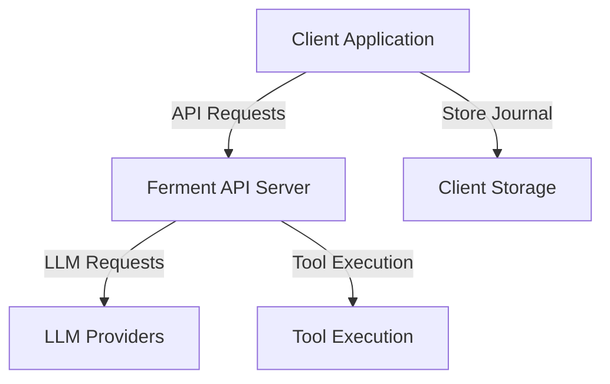
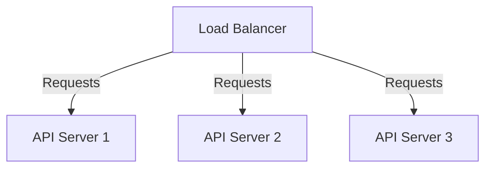

# Operations: Ferment AI

*Note: As the project is in the planning phase, this document outlines the planned operational aspects of the system. It will be updated as the system is implemented and deployed.*

## Deployment Architecture

Ferment AI is designed to be deployed as a stateless API service. The planned deployment architecture includes:



### Components

1. **Ferment API Server**
   - Node.js application serving the API
   - Stateless operation
   - Handles request processing and response streaming

2. **Client Application**
   - Consumes the Ferment API
   - Stores and manages journal state
   - Provides user interface for interaction

3. **LLM Providers**
   - External services (OpenAI, Anthropic, etc.)
   - Provide language model capabilities

4. **Tool Execution**
   - Local execution environment for tools
   - Access to file system, command execution, etc.

## Resource Naming

### Development Environment

- **API Server**: `ferment-api-dev`
- **Docker Container**: `ferment-api-dev`
- **Configuration**: `ferment-config-dev.json`
- **Logs**: `ferment-api-dev.log`

### Staging Environment

- **API Server**: `ferment-api-staging`
- **Docker Container**: `ferment-api-staging`
- **Configuration**: `ferment-config-staging.json`
- **Logs**: `ferment-api-staging.log`

### Production Environment

- **API Server**: `ferment-api-prod`
- **Docker Container**: `ferment-api-prod`
- **Configuration**: `ferment-config-prod.json`
- **Logs**: `ferment-api-prod.log`

## Relationship to Source Code

### Source Code Organization

```
ferment/
├── src/
│   ├── constructs/       # Configuration constructs
│   ├── runtime/          # Runtime implementation
│   ├── journal/          # Journal system
│   ├── tools/            # Tool implementations
│   ├── api/              # API server
│   └── utils/            # Utility functions
├── examples/             # Example configurations
├── tests/                # Test suite
└── docs/                 # Documentation
```

### Deployment Artifacts

- **API Server**: Built from `src/api/`
- **Configuration Library**: Built from `src/constructs/`
- **Runtime Library**: Built from `src/runtime/`

## Operational Procedures

### Deployment

#### Local Development

```bash
# Install dependencies
npm install

# Build the project
npm run build

# Start the development server
npm run dev
```

#### Docker Deployment

```bash
# Build the Docker image
docker build -t ferment-api .

# Run the container
docker run -p 8082:8082 ferment-api
```

#### Production Deployment

```bash
# Build for production
npm run build

# Start the production server
npm start
```

### Monitoring

#### Logs

- **Development**: Console output and `logs/ferment-api-dev.log`
- **Staging**: `logs/ferment-api-staging.log`
- **Production**: `logs/ferment-api-prod.log`

#### Metrics

- **API Requests**: Count, latency, error rate
- **LLM Requests**: Count, latency, token usage
- **Tool Execution**: Count, latency, error rate
- **Journal Size**: Average, maximum

### Backup and Recovery

As the system is stateless, there is no server-side state to back up. However, clients should implement their own backup strategies for journal state.

#### Client-Side Backup Recommendations

- Regular serialization of journal state
- Secure storage of journal backups
- Version control for journal state

### Scaling

#### Horizontal Scaling

The stateless nature of the API allows for horizontal scaling:



#### Resource Scaling

- **CPU**: Each API server should have at least 2 CPU cores
- **Memory**: Each API server should have at least 4GB RAM
- **Network**: High bandwidth for streaming responses

### Security

#### API Security

- HTTPS for all communications
- API key authentication
- Rate limiting to prevent abuse

#### Tool Execution Security

- Restricted file system access
- Limited command execution capabilities
- Timeout for long-running operations

## Operational Checklist

### Pre-Deployment

- [ ] Build and test locally
- [ ] Run unit and integration tests
- [ ] Check for security vulnerabilities
- [ ] Update configuration

### Deployment

- [ ] Deploy to staging environment
- [ ] Run smoke tests
- [ ] Monitor for issues
- [ ] Deploy to production

### Post-Deployment

- [ ] Verify API functionality
- [ ] Monitor performance metrics
- [ ] Check error rates
- [ ] Update documentation if needed

## Troubleshooting

### Common Issues

1. **API Connection Failures**
   - Check network connectivity
   - Verify API server is running
   - Check for firewall issues

2. **LLM Provider Errors**
   - Verify API keys are valid
   - Check provider status
   - Review rate limits

3. **Tool Execution Failures**
   - Check permissions
   - Verify required dependencies
   - Review error logs

4. **Journal Serialization Issues**
   - Check for malformed events
   - Verify journal structure
   - Review serialization code