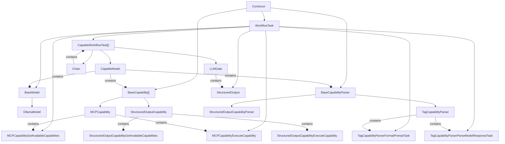
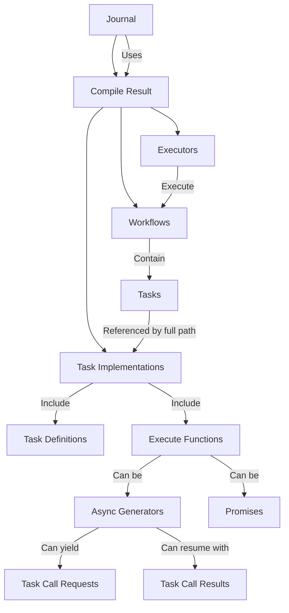
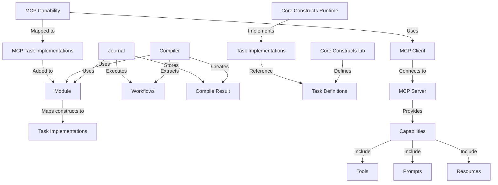

# System Patterns: Ferment AI

## Architectural Patterns

### 1. Construct-Based Architecture

Ferment AI uses the AWS CDK constructs library to create a hierarchical, composable architecture:



- **L1 Constructs**: Core primitives (WorkflowTask, BaseModel, BaseCapability, BaseCapabilityParser, etc.)
- **L2 Constructs**: Combinations of L1 constructs for common patterns (to be implemented)
- **L3 Constructs**: High-level, domain-specific constructs (to be implemented)

This pattern enables:
- Clear separation between declaration and runtime
- Composition and reuse of components
- Type-safe configuration
- Hierarchical organization of complex systems

### 2. Workflow-Based Architecture

The system implements a workflow-based architecture with async generator task functions:



This pattern enables:
- Clear definition of task sequences and relationships
- Modular and composable workflows
- Stateful execution with serialization/deserialization
- Audit trail of all operations
- Task suspension and resumption
- Type validation between task calls

### 3. Module-Based Extensibility

Components communicate through a module-based pattern:



This pattern enables:
- Loose coupling between components
- Extensibility through additional modules
- Clear separation of concerns
- Separation of task definitions and implementations
- Integration with external capability providers through MCP

## Implementation Patterns

### 1. Base Construct Pattern

The `FermentConstruct` class serves as the base for all Ferment constructs:

```typescript
export abstract class FermentConstruct extends Construct {
  public readonly description?: string;

  constructor(scope: Construct, id: string, props: FermentConstructProps = {}) {
    super(scope, id);
    this.description = props.description;
  }

  public override toString(): string {
    return `${this.node.id}${this.description ? ` (${this.description})` : ''}`;
  }
}
```

This pattern provides:
- Common properties and methods for all constructs
- Consistent initialization
- Clear identification of constructs

### 2. Virtual Model Pattern

The `VirtualModel` class represents a complete agent system:

```typescript
export class VirtualModel extends FermentConstruct {
  public readonly name: string;
  private _entrypoint?: Construct;
  private _exitPoint?: Construct;

  constructor(scope: Construct, id: string, props: VirtualModelProps = {}) {
    super(scope, id, props);
    this.name = props.name ?? id;
  }

  public set entrypoint(entrypoint: Construct) {
    this._entrypoint = entrypoint;
  }

  public get entrypoint(): Construct | undefined {
    return this._entrypoint;
  }

  public set exitPoint(exitPoint: Construct) {
    this._exitPoint = exitPoint;
  }

  public get exitPoint(): Construct | undefined {
    return this._exitPoint;
  }

  public validate(): void {
    if (!this._entrypoint) {
      throw new Error(`Virtual model ${this.name} must have an entrypoint`);
    }
  }
}
```

This pattern provides:
- A container for agent contexts
- Entry and exit points for the system
- Validation of the system configuration

### 3. WorkflowTask-Based Architecture

The `WorkflowTask` class serves as the base for many components in the system:

```typescript
export abstract class WorkflowTask<I extends z.ZodTypeAny, O extends z.ZodTypeAny> extends Construct {
  public abstract readonly taskDef: TaskDef<I, O>;

  constructor(scope: Construct, id: string, props = {}) {
    super(scope, id);
  }

  getTools(): Record<string, WorkflowTask<z.ZodTypeAny, z.ZodTypeAny>> {
    return {
      [this.node.path]: this
    };
  }
}
```

This pattern provides:
- A common base class for tasks, models, and capability components
- Type-safe input and output definitions using Zod
- Consistent interface for task execution
- Integration with the workflow system

### 4. Model Pattern

The `Model` class represents an LLM provider:

```typescript
export abstract class Model extends FermentConstruct {
  public readonly modelId: string;
  protected readonly apiKey?: string;
  protected readonly baseUrl?: string;
  protected readonly parameters: Record<string, any>;

  constructor(scope: Construct, id: string, props: ModelProps) {
    super(scope, id, props);
    this.modelId = props.model;
    this.apiKey = props.apiKey;
    this.baseUrl = props.baseUrl;
    this.parameters = props.parameters ?? {};
  }
}
```

This pattern provides:
- Common configuration for LLM providers
- Specific implementations for different providers (OpenAI, Anthropic)
- Consistent interface for agent contexts

### 5. Tool Pattern

The `Tool` class represents a capability that can be used by an agent:

```typescript
export abstract class Tool<
  TInputSchema extends z.ZodType = z.ZodType,
  TOutputSchema extends z.ZodType = z.ZodType
> extends FermentConstruct {
  public override readonly description: string;
  public readonly name: string;
  public abstract readonly inputSchema: TInputSchema;
  public abstract readonly outputSchema: TOutputSchema;

  constructor(scope: Construct, id: string, props: ToolProps) {
    super(scope, id, props);
    this.name = props.name;
    this.description = props.description;
  }

  public toJsonSchema(): Record<string, any> {
    return {
      name: this.name,
      description: this.description,
      input_schema: zodToJsonSchema(this.inputSchema),
      output_schema: zodToJsonSchema(this.outputSchema),
    };
  }
}
```

This pattern provides:
- Schema validation for tool inputs and outputs
- Conversion to JSON Schema for documentation
- Specific implementations for different tool types (File, Command)

### 6. Workflow Pattern

The `Workflow` class represents a sequence of tasks:

```typescript
export class Workflow extends Construct {
  private readonly definition: Workflow.Task;

  constructor(scope: Construct, id: string, options: WorkflowOptions) {
    super(scope, id);
    this.definition = options.definition;
  }

  getDefinition(): WorkflowDefinition {
    const tasks: Record<string, TaskDefinition> = {};
    const entryPoints: Record<string, string> = {
      'default': this.definition.node.path
    };

    // Add the entry point task
    tasks[this.definition.node.path] = this.definition.getDefinition();

    // Add all tasks reachable from the entry point
    this.addReachableTasks(this.definition, tasks);

    return {
      id: this.node.id,
      name: this.node.id,
      description: this.options.description,
      tasks,
      entryPoints
    };
  }
}
```

This pattern provides:
- A container for tasks
- Definition of task relationships
- Conversion to a serializable workflow definition

### 7. Task Pattern

The `Task` class represents a unit of work in a workflow:

```typescript
export class Task extends Construct {
  private readonly nextTasks: Task[] = [];
  private readonly tools: Record<string, Task> = {};

  constructor(scope: Construct, id: string, options = {}) {
    super(scope, id);
  }

  canCall(task: Task): this {
    this.nextTasks.push(task);
    return this;
  }

  canCallAndReturn(tool: Task): this {
    const toolPath = tool.node.path;
    this.tools[toolPath] = tool;
    return this;
  }

  sendEmailTool(): Task {
    const tool = new Task(this, `${this.node.id}SendEmailTool`, {
      description: `Send an email to ${this.node.id}`
    });
    return tool;
  }

  getDefinition(): TaskDefinition {
    return {
      id: this.node.path,
      name: this.node.id,
      description: this.options.description,
      inputSchema: this.options.inputSchema || {
        type: 'object',
        schema: {}
      },
      outputSchema: this.options.outputSchema || {
        type: 'object',
        schema: {}
      }
    };
  }
}
```

This pattern provides:
- A unit of work in a workflow
- Definition of task relationships
- Creation of tools for communication

### 8. Task Implementation Pattern

The new `TaskImpl` interface represents a task implementation:

```typescript
export interface TaskImpl<I extends z.ZodTypeAny, O extends z.ZodTypeAny> {
  def: TaskDef<I, O>;
  taskId: string;
  execute: TaskExecuteFunction<I, O>;
}

export type TaskExecuteGenerator<I extends z.ZodTypeAny, O extends z.ZodTypeAny> =
  (ctx: TaskCtx<I, O>) => AsyncGenerator<TaskCallAndReturnRequest, TaskCallRequest | TaskCallResult, TaskCallResult>;

export type TaskExecutePromise<I extends z.ZodTypeAny, O extends z.ZodTypeAny> =
  (ctx: TaskCtx<I, O>) => Promise<TaskCallResult>;

export type TaskExecuteFunction<I extends z.ZodTypeAny, O extends z.ZodTypeAny> =
  TaskExecuteGenerator<I, O> | TaskExecutePromise<I, O>;
```

This pattern provides:
- A clear interface for task implementations
- Support for both async generator and promise-based execution
- Type safety with Zod validation
- Separation of task definition and implementation

### 9. Task Definition Pattern

The new `TaskDef` interface represents a task definition:

```typescript
export interface TaskDef<I extends z.ZodTypeAny, O extends z.ZodTypeAny> {
  taskDefId: string; // distinct from taskId because this is global
  inputType: I;
  outputType: O;
}
```

This pattern provides:
- A clear interface for task definitions
- Type safety with Zod validation
- Separation from task implementation

### 10. Model Context Protocol (MCP) Integration Pattern

The Model Context Protocol (MCP) enables communication with external capability servers:

```typescript
export class MCPCapability extends BaseCapability {
  public getAvailableCapabilities: WorkflowTask<typeof GET_AVAILABLE_CAPABILITIES_TASK_DEF.inputType, typeof GET_AVAILABLE_CAPABILITIES_TASK_DEF.outputType>;
  public executeCapability: WorkflowTask<typeof EXECUTE_CAPABILITY_TASK_DEF.inputType, typeof EXECUTE_CAPABILITY_TASK_DEF.outputType>;

  public readonly props: MCPToolProps;

  constructor(scope: Construct, id: string, props: MCPToolProps) {
    super(scope, id);
    this.props = props;
    const subProps: MCPCapabilityTaskProps = {
      mcpCapability: this
    }
    this.getAvailableCapabilities = new MCPCapabilityGetAvailableCapabilities(this, 'GetAvailableCapabilities', subProps);
    this.executeCapability = new MCPCapabilityExecuteCapability(this, 'ExecuteCapability', subProps);
  }
}
```

This pattern provides:
- Connection to external MCP servers via HTTP or stdio transports
- Discovery of available capabilities (tools, prompts, resources)
- Execution of capabilities with proper input/output handling
- Integration with the workflow system

### 11. CapableModel Pattern

The `CapableModel` class combines a model with capabilities:

```typescript
export class CapableModel extends CapableWorkflowTask {
  public readonly props: CapableModelProps;

  constructor(
    scope: Construct,
    id: string,
    props: CapableModelProps
  ) {
    super(scope, id, {})
    this.props = props;
  }

  pushCapability(capability: BaseCapability) {
    this.props.capabilities.push(capability);
  }

  override getTools(): Record<string, WorkflowTask<z.ZodTypeAny, z.ZodTypeAny>> {
    const tools = {
      ...super.getTools(),
      ...this.props.capabilityParser.getTools(),
      [this.props.model.node.path]: this.props.model,
    };

    for(const capability of this.props.capabilities) {
      Object.assign(tools, capability.getTools());
    }

    return tools;
  }
}
```

This pattern provides:
- Combination of a model with capabilities and a capability parser
- Management of tool execution and result processing
- Integration with the workflow system
- Special handling for different capability types

### 12. TagCapabilityParser Pattern

The `TagCapabilityParser` class extracts tool invocations from model responses:

### 13. StructuredOutput Pattern

The StructuredOutput pattern enables type-safe data extraction from LLM responses using Zod schemas. Here's how to use it:

```typescript
// Create a model
const testModel = new OllamaModel(this, 'TestModel', {
    host: "ollama:11434",
    modelName: "deepseek-r1:8b"
});

// Create a capability parser
const capabilityParser = new StructuredOutputCapabilityParser(this, "CapabilityParser", {});

// Create a capable model
const capableModel = new CapableModel(this, "CapableModel", {
    model: testModel,
    capabilities: [],
    capabilityParser
});

// Create a structured output with a Zod schema
const structuredOutput = new StructuredOutput(this, "StructuredOutput", {
    capableModel,
    outputType: z.strictObject({
        accountholderName: z.string(),
        accountType: z.string(),
        currentBalance: z.number(),
        mostRecentDepositAmount: z.number().min(0),
        mostRecentWithdrawalAmount: z.number().max(0)
    })
});

// Create a workflow with the structured output
const workflow = new Workflow(this, 'Workflow', {
    definition: structuredOutput
});
```

This pattern provides:
- Type-safe data extraction from LLM responses
- Validation of LLM outputs against a schema
- Clear definition of expected output structure
- Integration with CapableModel
- Support for complex nested data structures

### 14. LLMGate Pattern

The LLMGate pattern enables conditional workflow execution based on LLM outputs. Here's how to use it:

```typescript
// Create a model
const testModel = new OllamaModel(this, 'TestModel', {
    host: "ollama:11434",
    modelName: "deepseek-r1:8b",
});

// Create a capability parser
const capabilityParser = new StructuredOutputCapabilityParser(this, 'StructuredOutputCapabilityParser');

// Create a capable model
const capableModel = new CapableModel(this, 'CapableModel', {
    model: testModel,
    capabilities: [],
    capabilityParser
});

// Create a range-based gate that passes if score is between 7 and 10
const rangeGate = new LLMGate(this, 'RangeGate', {
    capableModel: capableModel,
    prompt: "Please analyze the sentiment of the text and provide a score from 1-10 where 1 is very negative and 10 is very positive. Return only a JSON object with a 'score' field.",
    condition: {
        type: "pass_if_in_range",
        gte: 7,      // Pass if score >= 7
        lte: 10,     // Pass if score <= 10
        min: 1,      // Minimum valid score
        max: 10      // Maximum valid score
    }
});

// Create a regex-based gate that passes if the response contains specific words
const regexGate = new LLMGate(this, 'RegexGate', {
    capableModel: capableModel,
    prompt: "Describe the emotion in this sentence: 'I just won the lottery!'",
    condition: {
        type: "pass_if_regex_matches",
        regex: "happy|joy|excited|ecstatic"
    }
});

// Create workflows with the gates
const rangeGateWorkflow = new Workflow(this, 'RangeGateWorkflow', {
    definition: rangeGate
});

const regexGateWorkflow = new Workflow(this, 'RegexGateWorkflow', {
    definition: regexGate
});
```

This pattern provides:
- Conditional workflow execution based on LLM outputs
- Support for numeric range conditions (pass_if_in_range, fail_if_in_range)
- Support for regex pattern matching (pass_if_regex_matches, fail_if_regex_matches)
- Integration with StructuredOutput for reliable data extraction
- Exception throwing when conditions are not met

### 15. Chain Pattern

The Chain pattern enables sequential execution of workflow tasks. Here's how to use it:

```typescript
// Create models and capabilities
const testModel = new OllamaModel(this, 'TestModel', {
    host: "ollama:11434",
    modelName: "llama3.1:70b",
});

const mcp = new MCPCapability(this, 'MCPCapability', {
    transport: {
      type: 'stdio',
      command: 'node',
      args: [path.join(process.cwd(), './packages/dad-joke-mcp/dist/main.js')]
    }
});

const capabilityParser = new StructuredOutputCapabilityParser(this, "CapabilityParser", {});

const capableModelWithMcp = new CapableModel(this, "CapableModelWithMcps", {
    model: testModel,
    capabilities: [mcp],
    capabilityParser
});

const capableModelWithoutMcp = new CapableModel(this, "CapableModelWithoutMcps", {
    model: testModel,
    capabilities: [],
    capabilityParser
});

// Create a chain and add links
const chain = new Chain(this, 'Chain');

// Add a task to modify the prompt
chain.pushLink(new EditMessagesTask(this, 'DadJokePrompt', {
    appendToLatestMessage: "Look up a random dad joke using the provided tool."
}));

// Add a model with MCP capability
chain.pushLink(capableModelWithMcp);

// Add a gate to check joke quality
chain.pushLink(new LLMGate(this, 'ConfirmDadJoke', {
    capableModel: capableModelForConfirmingDadJoke,
    prompt: "Please analyze how funny the joke is and provide a score from 1-10.",
    condition: {
        type: "pass_if_in_range",
        gte: 7,
        lte: 10,
        min: 1,
        max: 10
    }
}));

// Add another task
chain.pushLink(new EditMessagesTask(this, 'TranslationPrompt', {
    messagesPush: [
        {
            role: "user",
            content: "Translate the full text into Spanish."
        }
    ]
}));

// Add a model without MCP capability
chain.pushLink(capableModelWithoutMcp);

// Create a workflow with the chain
const workflow = new Workflow(this, 'Workflow', {
    definition: chain
});
```

This pattern provides:
- Sequential execution of workflow tasks
- Simple API for adding links to the chain
- Composition of complex workflows from simpler components
- Integration with other workflow components like LLMGate and EditMessagesTask
- Clear definition of task execution order

```typescript
export class TagCapabilityParser extends BaseCapabilityParser {
  public formatPrompt: WorkflowTask<typeof FORMAT_PROMPT_TASK_DEF.inputType, typeof FORMAT_PROMPT_TASK_DEF.outputType>;
  public parseModelResponse: WorkflowTask<typeof PARSE_MODEL_RESPONSE_TASK_DEF.inputType, typeof PARSE_MODEL_RESPONSE_TASK_DEF.outputType>;

  public readonly props: TagCapabilityParserProps;

  constructor(scope: Construct, id: string, props?: Partial<TagCapabilityParserProps>) {
    super(scope, id);
    this.props = {
      prompt: DEFAULT_PROMPT_STRING,
      promptTemplateEngine: 'dot',
      ...(props ?? {})
    };
    const subProps = {
      tagCapabilityParser: this
    };
    this.formatPrompt = new TagCapabilityParserFormatPromptTask(this, 'FormatPrompt', subProps);
    this.parseModelResponse = new TagCapabilityParserParseModelResponseTask(this, 'ParseModelResponse', subProps);
  }
}
```

This pattern provides:
- Template-based prompt formatting with available capabilities
- Regex-based parsing of model responses
- Support for different invocation formats:
  - `<tool:NAME>JSON</tool>`
  - `<prompt:NAME>JSON</prompt>`
  - `<resource:NAME>URI</resource>`
  - `<function=NAME>JSON</function>`
- Prefix handling for capability names


### 16. Router Pattern

The Router pattern classifies an input and directs it to a specialized task. This allows for separation of concerns and building more specialized prompts. Here's how to use it:

```typescript
// Create models for different routes
const greetingModel = new OllamaModel(this, 'GreetingModel', {
  host: "ollama:11434",
  modelName: "llama3.1:8b",
});

const weatherModel = new OllamaModel(this, 'WeatherModel', {
  host: "ollama:11434",
  modelName: "llama3.1:8b",
});

const mathModel = new OllamaModel(this, 'MathModel', {
  host: "ollama:11434",
  modelName: "llama3.1:8b",
});

// Create capable models for different routes
const greetingCapableModel = new CapableModel(this, "GreetingCapableModel", {
  model: greetingModel,
  capabilities: [],
  capabilityParser: new StructuredOutputCapabilityParser(this, "GreetingCapabilityParser", {})
});

const weatherCapableModel = new CapableModel(this, "WeatherCapableModel", {
  model: weatherModel,
  capabilities: [],
  capabilityParser: new StructuredOutputCapabilityParser(this, "WeatherCapabilityParser", {})
});

const mathCapableModel = new CapableModel(this, "MathCapableModel", {
  model: mathModel,
  capabilities: [],
  capabilityParser: new StructuredOutputCapabilityParser(this, "MathCapabilityParser", {})
});

// Create a model for the router
const routerModel = new OllamaModel(this, 'RouterModel', {
  host: "ollama:11434",
  modelName: "llama3.1:8b",
});

// Create a capable model for the router
const routerCapableModel = new CapableModel(this, "RouterCapableModel", {
  model: routerModel,
  capabilities: [],
  capabilityParser: new StructuredOutputCapabilityParser(this, "RouterCapabilityParser", {})
});

// Create a custom template for the router
const customTemplate = `
You are a router that classifies input and directs it to the most appropriate specialized task.

Here are the available routes:
{{~it.routes :route}}
- {{=route.name}}: {{=route.description}}
{{~}}

Based on the following input, select the most appropriate route:
{{=it.input}}

Return ONLY a JSON object with a "route" field containing the name of the selected route.
Example: { "route": "greeting" }
`;

// Create a router with the tasks
const router = new Router(this, 'Router', {
  capableModel: routerCapableModel,
  routes: [
    {
      name: "greeting",
      description: "Greetings, introductions, and general pleasantries",
      task: greetingCapableModel
    },
    {
      name: "weather",
      description: "Weather forecasts, conditions, and related questions",
      task: weatherCapableModel
    },
    {
      name: "math",
      description: "Mathematical calculations, equations, and problems",
      task: mathCapableModel
    }
  ],
  template: customTemplate,
  defaultRoute: "greeting"
});

// Create a workflow with the router
const workflow = new Workflow(this, 'Workflow', {
  definition: router
});
```

This pattern provides:
- Classification of inputs and routing to specialized tasks
- Separation of concerns with specialized models for different types of queries
- Customizable routing templates
- Default route fallback for unclassified inputs
- Integration with StructuredOutput for reliable routing decisions
- Error handling with fallback to default route

### 17. TemplateParser Pattern
The `BaseTemplateParser` class provides a common interface for template parsing:

```typescript
export abstract class BaseTemplateParser extends WorkflowTask<typeof RENDER_TEMPLATE_TASK_DEF.inputType, typeof RENDER_TEMPLATE_TASK_DEF.outputType> {
  public override taskDef = RENDER_TEMPLATE_TASK_DEF;

  constructor(scope: Construct, id: string, props = {}) {
    super(scope, id, props);
  }
}
```

The `DotTemplateParser` class implements the BaseTemplateParser using the dot template engine:

```typescript
export class DotTemplateParser extends BaseTemplateParser {
  public readonly props: DotTemplateParserProps;

  constructor(scope: Construct, id: string, props: DotTemplateParserProps) {
    super(scope, id, {});
    this.props = {
      template: props.template,
      stripWhitespace: props.stripWhitespace ?? false
    };
  }
}
```

This pattern provides:
- Separation of template parsing logic from capability parsers
- Reusable template rendering functionality
- Support for different template engines through a common interface
- Simplified template management with dedicated constructs
- Improved testability of template rendering logic

## Package Structure and Responsibilities

The Ferment AI system is organized into several packages, each with a specific responsibility:

### 1. Core Constructs Library (`@ferment-ai/core-constructs-lib`)

This package defines the constructs using the AWS CDK Constructs library and task definitions. It defines the relationship between components and what they have access to, but does NOT define how to actually run them.

Key components:
- `WorkflowTask`: Base class for many components
- `BaseModel`: Base class for model implementations
- `BaseCapability`: Base class for capability implementations
- `BaseCapabilityParser`: Base class for capability parser implementations
- `CapableModel`: Class that combines models with capabilities
- `MCPCapability`: Class for connecting to MCP servers
- `TagCapabilityParser`: Class for extracting tool invocations from model responses
- `TaskDef`: Interface for task definitions

### 2. Runtime Common (`@ferment-ai/runtime-common`)

This package defines interfaces and utilities that both core-constructs-runtime and runtime will implement. It serves as a contract between the definition and runtime layers.

Key components:
- `Module`: Interface for modules that map constructs to task implementations
- `Workflow`: Interface for workflows
- `Task`: Interface for tasks
- `Journal`: Interface for the journal system
- `WorkflowDefinition`: Interface for workflow definitions
- `TaskDefinition`: Interface for task definitions
- `TaskImpl`: Interface for task implementations
- `TaskExecuteFunction`: Type for task execution functions
- `compileWorkflow`: Function to compile a workflow into an executor

### 3. Core Constructs Runtime (`@ferment-ai/core-constructs-runtime`)

This package defines how to run the constructs at runtime by mapping them to task implementations. It has a 1-to-1 relationship with core-constructs-lib.

Key components:
- `createCoreConstructsModule`: Function that creates a module for core constructs
- Task implementations for each construct type (BaseModel, OllamaModel, CapableModel, MCPCapability, TagCapabilityParser)

### 4. Runtime In-Memory (`@ferment-ai/runtime-in-memory`)

This package implements the journal interface with an in-memory implementation.

Key components:
- `Journal`: Implementation of the journal interface
- Workflow execution
- State management
- Serialization/deserialization

## Key Technical Decisions

1. **Async Generator TaskFunction**: We've refactored TaskFunction to be an async generator/AsyncIterable function, enabling suspension and resumption of tasks.

2. **Task Definitions in core-constructs-lib**: Task definitions are now located in the core-constructs-lib package, while task implementations remain in core-constructs-runtime.

3. **Zod Type Validation**: We've implemented Zod validation for inputs and outputs between task calls, ensuring type safety at runtime.

4. **Support for Both Promise and Generator Patterns**: The system now supports both promise-based task functions (for simple tasks) and generator-based task functions (for complex tasks that need to call other tasks).

5. **TaskImpl Interface**: We've created a new TaskImpl interface that includes the task definition, task ID, and execute function.

6. **Serializable Task Messages**: All task messages (TaskCallRequest, TaskCallResult, TaskCallAndReturnRequest) are designed to be serializable as JSON.

7. **Workflow-Based Architecture**: We've implemented a workflow-based architecture where workflows are composed of tasks with defined relationships.

8. **Using AWS CDK Constructs**: We're using the actual "constructs" npm package from AWS CDK as the foundation for our configuration system.

9. **Journal as Central Executor**: The journal is the central executor for workflows, maintaining state and providing serialization/deserialization.

10. **Module-Based Mapping**: We've implemented a module system that maps constructs to task implementations, allowing for modular and extensible system configuration.

11. **Stateless API Design**: The system has no persistence and relies on a stateless API, where each request creates a new journal instance that runs until completion and returns the results.

12. **Task-Based Execution**: Model calls, tool calls, etc. are represented as tasks with defined relationships, allowing for better tracking and management of operations.

13. **Package Structure**: We've organized the codebase into multiple packages to maintain separation of concerns and enable modular development, with clear interfaces between the definition and runtime layers.

14. **Full Path Task References**: Task functions are indexed by the full path (node.path) instead of just the ID (node.id), ensuring that task names are globally unique within a construct tree.

15. **Tool Implementation with Zod**: We're using Zod for schema validation in our tools, which provides runtime type safety and clear error messages.

16. **TypeScript Configuration**: We've configured TypeScript to use the appropriate module resolution strategy and other compiler options.

17. **Testing with Jest**: We're using Jest for testing, with comprehensive tests for the workflow architecture components.

18. **Model Context Protocol (MCP) Integration**: We've implemented support for the Model Context Protocol, allowing connection to external capability servers.

19. **CapableModel Architecture**: We've created a CapableModel class that combines models with capabilities, enabling tool use in LLM interactions.

20. **TagCapabilityParser Implementation**: We've implemented a TagCapabilityParser that formats prompts with available capabilities and extracts tool invocations from model responses.

21. **Capability Types**: We support three types of capabilities: tools, prompts, and resources, each with different handling.

22. **Prefix Handling**: The TagCapabilityParser adds prefixes to capability names in prompts and strips them when parsing responses.

23. **Transport Options**: The MCPCapability supports both HTTP and stdio transports for connecting to MCP servers.

24. **Deprecation of AgentContext**: We're moving away from the AgentContext pattern in favor of the more flexible CapableModel pattern.