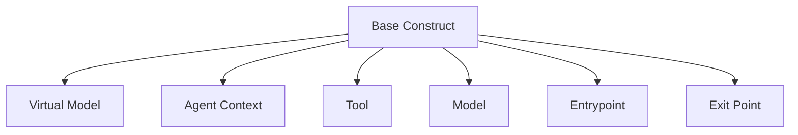
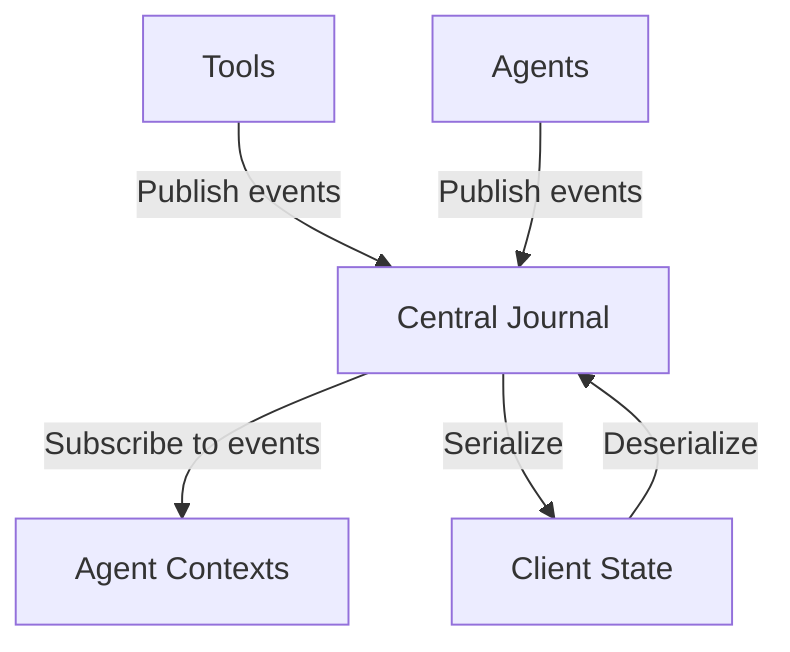
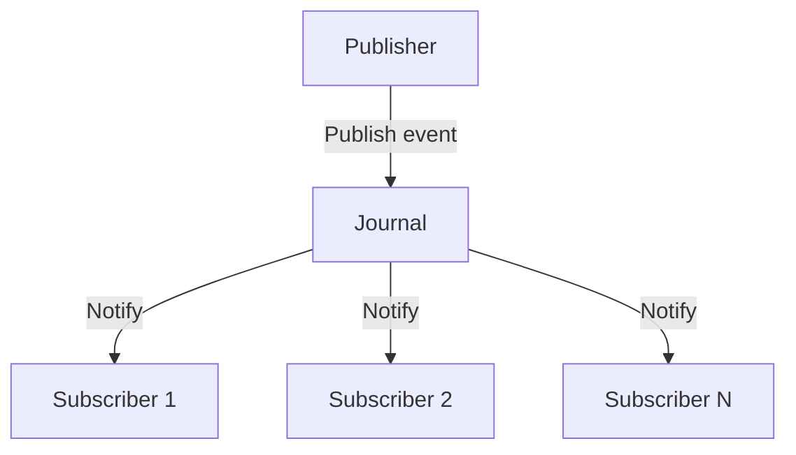
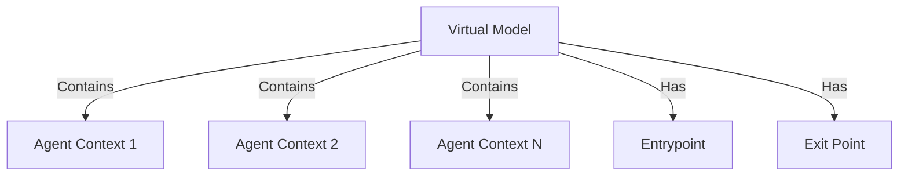
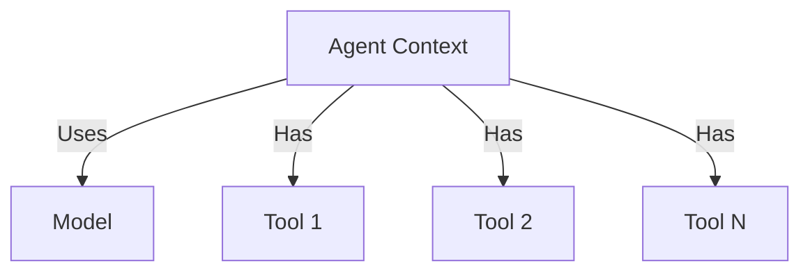
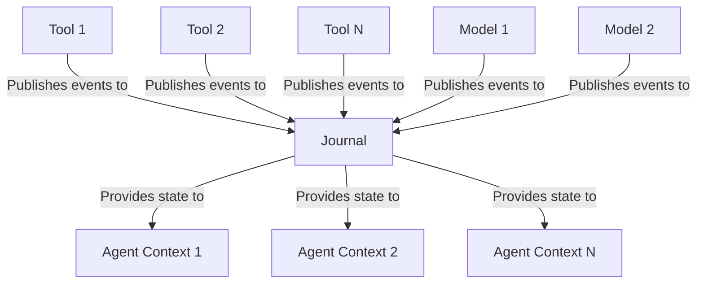

# System Patterns: Ferment AI

## Architectural Patterns

### 1. Construct-Based Architecture

Ferment AI uses the AWS CDK constructs library to create a hierarchical, composable architecture:



- **L1 Constructs**: Core primitives (VirtualModel, AgentContext, Tool, etc.)
- **L2 Constructs**: Combinations of L1 constructs for common patterns
- **L3 Constructs**: High-level, domain-specific constructs

This pattern enables:
- Clear separation between declaration and runtime
- Composition and reuse of components
- Type-safe configuration
- Hierarchical organization of complex systems

### 2. Journal-Centric Architecture

The journal is the central source of truth for the entire system:



This pattern enables:
- Stateless server operation
- Complete state reconstruction
- Pause/resume capabilities
- Clear audit trail of all operations

### 3. Pub-Sub Messaging

Components communicate through a pub-sub pattern:



This pattern enables:
- Loose coupling between components
- Asynchronous operation
- Scalability
- Extensibility

## Design Patterns

### 1. Factory Pattern

Used for creating instances of constructs:

```typescript
// Example factory for creating agent contexts
class AgentContextFactory {
  createAgentContext(scope: Construct, id: string, props: AgentContextProps): AgentContext {
    return new AgentContext(scope, id, props);
  }
}
```

### 2. Observer Pattern

Used for the pub-sub system:

```typescript
// Example observer pattern for journal events
interface JournalObserver {
  onEvent(event: JournalEvent): void;
}

class Journal {
  private observers: Map<string, JournalObserver[]> = new Map();
  
  subscribe(eventType: string, observer: JournalObserver): void {
    // Implementation
  }
  
  publish(event: JournalEvent): void {
    // Implementation
  }
}
```

### 3. Strategy Pattern

Used for different model implementations:

```typescript
// Example strategy pattern for models
interface ModelStrategy {
  generateResponse(prompt: string): Promise<string>;
}

class OpenAIModel implements ModelStrategy {
  generateResponse(prompt: string): Promise<string> {
    // Implementation
  }
}

class AnthropicModel implements ModelStrategy {
  generateResponse(prompt: string): Promise<string> {
    // Implementation
  }
}
```

### 4. Builder Pattern

Used for constructing complex objects:

```typescript
// Example builder pattern for agent contexts
class AgentContextBuilder {
  private model: Model;
  private tools: Tool[] = [];
  private prompt: string;
  
  withModel(model: Model): AgentContextBuilder {
    this.model = model;
    return this;
  }
  
  withTool(tool: Tool): AgentContextBuilder {
    this.tools.push(tool);
    return this;
  }
  
  withPrompt(prompt: string): AgentContextBuilder {
    this.prompt = prompt;
    return this;
  }
  
  build(scope: Construct, id: string): AgentContext {
    return new AgentContext(scope, id, {
      model: this.model,
      tools: this.tools,
      prompt: this.prompt
    });
  }
}
```

## Component Relationships

### 1. VirtualModel and AgentContext



### 2. AgentContext and Tools



### 3. Journal and Components



## Key Technical Decisions

1. **Using AWS CDK Constructs**: Provides a proven, well-designed pattern for declarative configuration.

2. **Journal as Source of Truth**: Simplifies state management and enables stateless operation.

3. **Pub-Sub for Component Communication**: Enables loose coupling and extensibility.

4. **Zod for Schema Validation**: Provides runtime type safety and clear error messages.

5. **TypeScript for Type Safety**: Catches errors at compile time and improves developer experience.

6. **Streaming for Real-Time Updates**: Provides transparency and immediate feedback.

7. **Client-Side State Storage**: Simplifies server architecture and enables easy scaling.