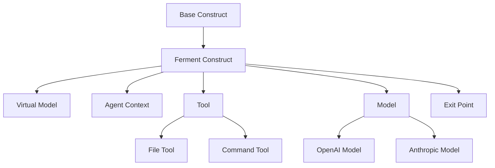
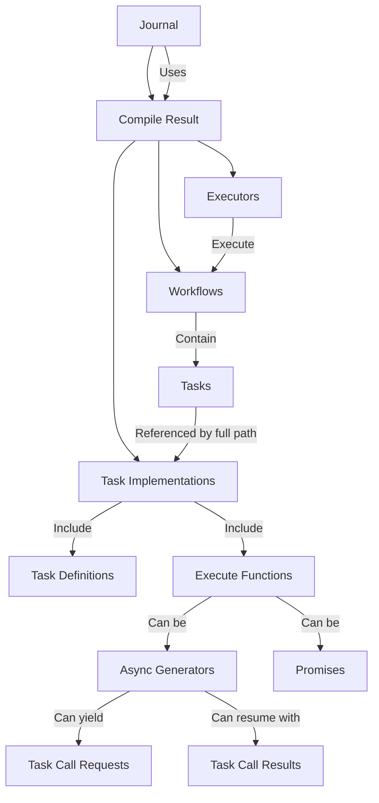
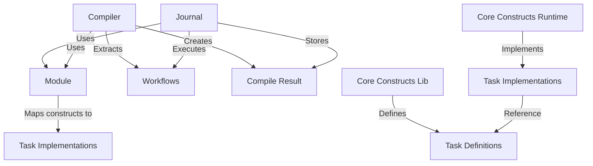

# System Patterns: Ferment AI

## Architectural Patterns

### 1. Construct-Based Architecture

Ferment AI uses the AWS CDK constructs library to create a hierarchical, composable architecture:



- **L1 Constructs**: Core primitives (FermentConstruct, VirtualModel, AgentContext, Tool, etc.)
- **L2 Constructs**: Combinations of L1 constructs for common patterns (to be implemented)
- **L3 Constructs**: High-level, domain-specific constructs (to be implemented)

This pattern enables:
- Clear separation between declaration and runtime
- Composition and reuse of components
- Type-safe configuration
- Hierarchical organization of complex systems

### 2. Workflow-Based Architecture

The system implements a workflow-based architecture with async generator task functions:



This pattern enables:
- Clear definition of task sequences and relationships
- Modular and composable workflows
- Stateful execution with serialization/deserialization
- Audit trail of all operations
- Task suspension and resumption
- Type validation between task calls

### 3. Module-Based Extensibility

Components communicate through a module-based pattern:



This pattern enables:
- Loose coupling between components
- Extensibility through additional modules
- Clear separation of concerns
- Separation of task definitions and implementations

## Implementation Patterns

### 1. Base Construct Pattern

The `FermentConstruct` class serves as the base for all Ferment constructs:

```typescript
export abstract class FermentConstruct extends Construct {
  public readonly description?: string;

  constructor(scope: Construct, id: string, props: FermentConstructProps = {}) {
    super(scope, id);
    this.description = props.description;
  }

  public override toString(): string {
    return `${this.node.id}${this.description ? ` (${this.description})` : ''}`;
  }
}
```

This pattern provides:
- Common properties and methods for all constructs
- Consistent initialization
- Clear identification of constructs

### 2. Virtual Model Pattern

The `VirtualModel` class represents a complete agent system:

```typescript
export class VirtualModel extends FermentConstruct {
  public readonly name: string;
  private _entrypoint?: Construct;
  private _exitPoint?: Construct;

  constructor(scope: Construct, id: string, props: VirtualModelProps = {}) {
    super(scope, id, props);
    this.name = props.name ?? id;
  }

  public set entrypoint(entrypoint: Construct) {
    this._entrypoint = entrypoint;
  }

  public get entrypoint(): Construct | undefined {
    return this._entrypoint;
  }

  public set exitPoint(exitPoint: Construct) {
    this._exitPoint = exitPoint;
  }

  public get exitPoint(): Construct | undefined {
    return this._exitPoint;
  }

  public validate(): void {
    if (!this._entrypoint) {
      throw new Error(`Virtual model ${this.name} must have an entrypoint`);
    }
  }
}
```

This pattern provides:
- A container for agent contexts
- Entry and exit points for the system
- Validation of the system configuration

### 3. Agent Context Pattern

The `AgentContext` class represents an environment for a single agent:

```typescript
export class AgentContext extends FermentConstruct {
  public readonly prompt: string;
  public readonly model: Construct;
  private readonly _tools: Construct[] = [];

  constructor(scope: Construct, id: string, props: AgentContextProps) {
    super(scope, id, props);
    this.prompt = props.prompt;
    this.model = props.model;

    if (props.tools) {
      for (const tool of props.tools) {
        this.addTool(tool);
      }
    }
  }

  public addTool(tool: Construct): AgentContext {
    this._tools.push(tool);
    return this;
  }

  public get tools(): Construct[] {
    return [...this._tools];
  }

  public newPromptTask(scope: Construct, id: string, options = {}): Workflow.Task {
    return new Workflow.Task(scope, id, options);
  }

  public sendEmailTool(): Construct {
    return new SendEmailTool(this, `${this.node.id}SendEmailTool`, {
      name: `Send Email to ${this.node.id}`,
      description: `Send a message to the ${this.node.id} agent`,
      targetAgent: this,
    });
  }
}
```

This pattern provides:
- A container for agent-specific configuration
- Management of tools available to the agent
- Creation of workflow tasks and communication tools

### 4. Model Pattern

The `Model` class represents an LLM provider:

```typescript
export abstract class Model extends FermentConstruct {
  public readonly modelId: string;
  protected readonly apiKey?: string;
  protected readonly baseUrl?: string;
  protected readonly parameters: Record<string, any>;

  constructor(scope: Construct, id: string, props: ModelProps) {
    super(scope, id, props);
    this.modelId = props.model;
    this.apiKey = props.apiKey;
    this.baseUrl = props.baseUrl;
    this.parameters = props.parameters ?? {};
  }
}
```

This pattern provides:
- Common configuration for LLM providers
- Specific implementations for different providers (OpenAI, Anthropic)
- Consistent interface for agent contexts

### 5. Tool Pattern

The `Tool` class represents a capability that can be used by an agent:

```typescript
export abstract class Tool<
  TInputSchema extends z.ZodType = z.ZodType,
  TOutputSchema extends z.ZodType = z.ZodType
> extends FermentConstruct {
  public override readonly description: string;
  public readonly name: string;
  public abstract readonly inputSchema: TInputSchema;
  public abstract readonly outputSchema: TOutputSchema;

  constructor(scope: Construct, id: string, props: ToolProps) {
    super(scope, id, props);
    this.name = props.name;
    this.description = props.description;
  }

  public toJsonSchema(): Record<string, any> {
    return {
      name: this.name,
      description: this.description,
      input_schema: zodToJsonSchema(this.inputSchema),
      output_schema: zodToJsonSchema(this.outputSchema),
    };
  }
}
```

This pattern provides:
- Schema validation for tool inputs and outputs
- Conversion to JSON Schema for documentation
- Specific implementations for different tool types (File, Command)

### 6. Workflow Pattern

The `Workflow` class represents a sequence of tasks:

```typescript
export class Workflow extends Construct {
  private readonly definition: Workflow.Task;

  constructor(scope: Construct, id: string, options: WorkflowOptions) {
    super(scope, id);
    this.definition = options.definition;
  }

  getDefinition(): WorkflowDefinition {
    const tasks: Record<string, TaskDefinition> = {};
    const entryPoints: Record<string, string> = {
      'default': this.definition.node.path
    };

    // Add the entry point task
    tasks[this.definition.node.path] = this.definition.getDefinition();

    // Add all tasks reachable from the entry point
    this.addReachableTasks(this.definition, tasks);

    return {
      id: this.node.id,
      name: this.node.id,
      description: this.options.description,
      tasks,
      entryPoints
    };
  }
}
```

This pattern provides:
- A container for tasks
- Definition of task relationships
- Conversion to a serializable workflow definition

### 7. Task Pattern

The `Task` class represents a unit of work in a workflow:

```typescript
export class Task extends Construct {
  private readonly nextTasks: Task[] = [];
  private readonly tools: Record<string, Task> = {};

  constructor(scope: Construct, id: string, options = {}) {
    super(scope, id);
  }

  canCall(task: Task): this {
    this.nextTasks.push(task);
    return this;
  }

  canCallAndReturn(tool: Task): this {
    const toolPath = tool.node.path;
    this.tools[toolPath] = tool;
    return this;
  }

  sendEmailTool(): Task {
    const tool = new Task(this, `${this.node.id}SendEmailTool`, {
      description: `Send an email to ${this.node.id}`
    });
    return tool;
  }

  getDefinition(): TaskDefinition {
    return {
      id: this.node.path,
      name: this.node.id,
      description: this.options.description,
      inputSchema: this.options.inputSchema || {
        type: 'object',
        schema: {}
      },
      outputSchema: this.options.outputSchema || {
        type: 'object',
        schema: {}
      }
    };
  }
}
```

This pattern provides:
- A unit of work in a workflow
- Definition of task relationships
- Creation of tools for communication

### 8. Task Implementation Pattern

The new `TaskImpl` interface represents a task implementation:

```typescript
export interface TaskImpl<I extends z.ZodTypeAny, O extends z.ZodTypeAny> {
  def: TaskDef<I, O>;
  taskId: string;
  execute: TaskExecuteFunction<I, O>;
}

export type TaskExecuteGenerator<I extends z.ZodTypeAny, O extends z.ZodTypeAny> =
  (ctx: TaskCtx<I, O>) => AsyncGenerator<TaskCallAndReturnRequest, TaskCallRequest | TaskCallResult, TaskCallResult>;

export type TaskExecutePromise<I extends z.ZodTypeAny, O extends z.ZodTypeAny> =
  (ctx: TaskCtx<I, O>) => Promise<TaskCallResult>;

export type TaskExecuteFunction<I extends z.ZodTypeAny, O extends z.ZodTypeAny> =
  TaskExecuteGenerator<I, O> | TaskExecutePromise<I, O>;
```

This pattern provides:
- A clear interface for task implementations
- Support for both async generator and promise-based execution
- Type safety with Zod validation
- Separation of task definition and implementation

### 9. Task Definition Pattern

The new `TaskDef` interface represents a task definition:

```typescript
export interface TaskDef<I extends z.ZodTypeAny, O extends z.ZodTypeAny> {
  taskDefId: string; // distinct from taskId because this is global
  inputType: I;
  outputType: O;
}
```

This pattern provides:
- A clear interface for task definitions
- Type safety with Zod validation
- Separation from task implementation

## Package Structure and Responsibilities

The Ferment AI system is organized into several packages, each with a specific responsibility:

### 1. Core Constructs Library (`@ferment-ai/core-constructs-lib`)

This package defines the constructs using the AWS CDK Constructs library and task definitions. It defines the relationship between agents and what they have access to, but does NOT define how to actually run the agent.

Key components:
- `FermentConstruct`: Base class for all Ferment constructs
- `VirtualModel`: Top-level container for agent systems
- `AgentContext`: Environment for a single agent
- `Model`: Interface for LLM providers
- `Tool`: Interface for tools that can be used by agents
- `ExitPoint`: Ending point for a virtual model
- `TaskDef`: Interface for task definitions

### 2. Runtime Common (`@ferment-ai/runtime-common`)

This package defines interfaces and utilities that both core-constructs-runtime and runtime will implement. It serves as a contract between the definition and runtime layers.

Key components:
- `Module`: Interface for modules that map constructs to task implementations
- `Workflow`: Interface for workflows
- `Task`: Interface for tasks
- `Journal`: Interface for the journal system
- `WorkflowDefinition`: Interface for workflow definitions
- `TaskDefinition`: Interface for task definitions
- `TaskImpl`: Interface for task implementations
- `TaskExecuteFunction`: Type for task execution functions
- `compileWorkflow`: Function to compile a workflow into an executor

### 3. Core Constructs Runtime (`@ferment-ai/core-constructs-runtime`)

This package defines how to run the constructs at runtime by mapping them to task implementations. It has a 1-to-1 relationship with core-constructs-lib.

Key components:
- `createCoreConstructsModule`: Function that creates a module for core constructs
- Task implementations for each construct type (Model, OpenAIModel, AgentContext, prompt tasks)

### 4. Runtime In-Memory (`@ferment-ai/runtime-in-memory`)

This package implements the journal interface with an in-memory implementation.

Key components:
- `Journal`: Implementation of the journal interface
- Workflow execution
- State management
- Serialization/deserialization

## Key Technical Decisions

1. **Async Generator TaskFunction**: We've refactored TaskFunction to be an async generator/AsyncIterable function, enabling suspension and resumption of tasks.

2. **Task Definitions in core-constructs-lib**: Task definitions are now located in the core-constructs-lib package, while task implementations remain in core-constructs-runtime.

3. **Zod Type Validation**: We've implemented Zod validation for inputs and outputs between task calls, ensuring type safety at runtime.

4. **Support for Both Promise and Generator Patterns**: The system now supports both promise-based task functions (for simple tasks) and generator-based task functions (for complex tasks that need to call other tasks).

5. **TaskImpl Interface**: We've created a new TaskImpl interface that includes the task definition, task ID, and execute function.

6. **Serializable Task Messages**: All task messages (TaskCallRequest, TaskCallResult, TaskCallAndReturnRequest) are designed to be serializable as JSON.

7. **Workflow-Based Architecture**: We've implemented a workflow-based architecture where workflows are composed of tasks with defined relationships.

8. **Using AWS CDK Constructs**: We're using the actual "constructs" npm package from AWS CDK as the foundation for our configuration system.

9. **Journal as Central Executor**: The journal is the central executor for workflows, maintaining state and providing serialization/deserialization.

10. **Module-Based Mapping**: We've implemented a module system that maps constructs to task implementations, allowing for modular and extensible system configuration.

11. **Stateless API Design**: The system has no persistence and relies on a stateless API, where each request creates a new journal instance that runs until completion and returns the results.

12. **Task-Based Execution**: Agent calls, tool calls, etc. are represented as tasks with defined relationships, allowing for better tracking and management of operations.

13. **Package Structure**: We've organized the codebase into multiple packages to maintain separation of concerns and enable modular development, with clear interfaces between the definition and runtime layers.

14. **Full Path Task References**: Task functions are indexed by the full path (node.path) instead of just the ID (node.id), ensuring that task names are globally unique within a construct tree.

15. **Tool Implementation with Zod**: We're using Zod for schema validation in our tools, which provides runtime type safety and clear error messages.

16. **TypeScript Configuration**: We've configured TypeScript to use the appropriate module resolution strategy and other compiler options.

17. **Testing with Jest**: We're using Jest for testing, with comprehensive tests for the workflow architecture components.