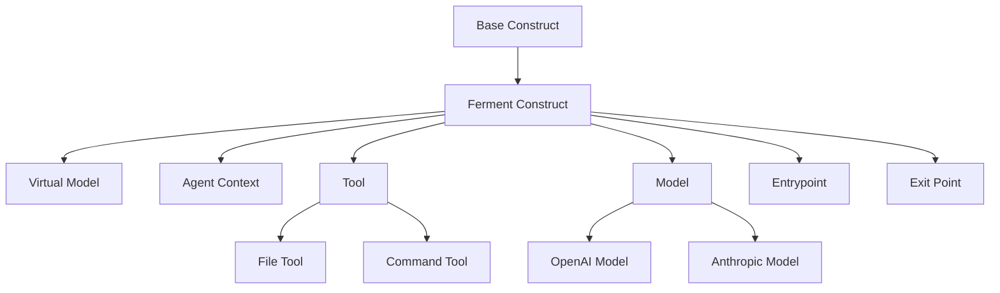
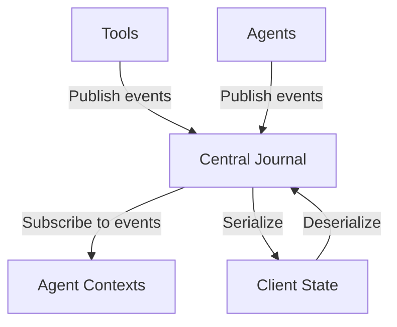
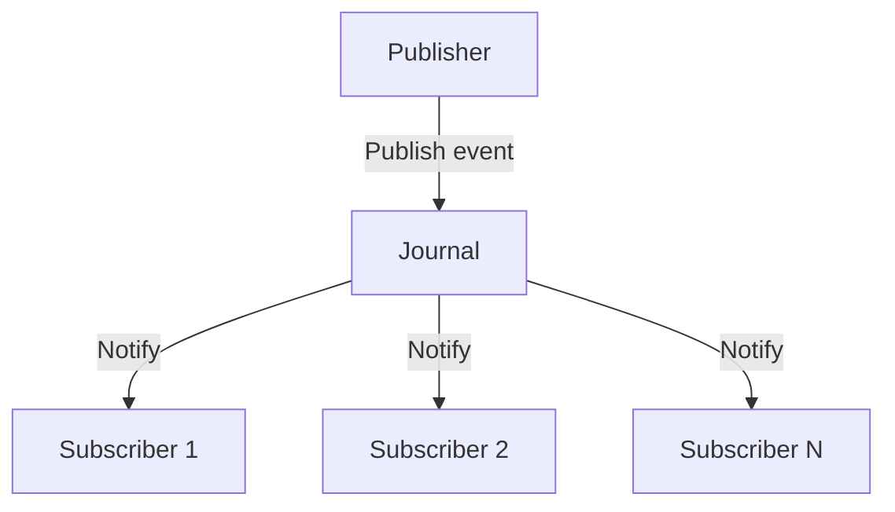

# System Patterns: Ferment AI

## Architectural Patterns

### 1. Construct-Based Architecture

Ferment AI uses the AWS CDK constructs library to create a hierarchical, composable architecture:



- **L1 Constructs**: Core primitives (FermentConstruct, VirtualModel, AgentContext, Tool, etc.)
- **L2 Constructs**: Combinations of L1 constructs for common patterns (to be implemented)
- **L3 Constructs**: High-level, domain-specific constructs (to be implemented)

This pattern enables:
- Clear separation between declaration and runtime
- Composition and reuse of components
- Type-safe configuration
- Hierarchical organization of complex systems

### 2. Journal-Centric Architecture

The journal is the central source of truth for the entire system:



This pattern enables:
- Stateless server operation
- Complete state reconstruction
- Pause/resume capabilities
- Clear audit trail of all operations

### 3. Pub-Sub Messaging

Components communicate through a pub-sub pattern:



This pattern enables:
- Loose coupling between components
- Asynchronous operation
- Scalability
- Extensibility

## Implementation Patterns

### 1. Base Construct Pattern

The `FermentConstruct` class serves as the base for all Ferment constructs:

```typescript
export abstract class FermentConstruct extends Construct {
  public readonly description?: string;

  constructor(scope: Construct, id: string, props: FermentConstructProps = {}) {
    super(scope, id);
    this.description = props.description;
  }

  public override toString(): string {
    return `${this.node.id}${this.description ? ` (${this.description})` : ''}`;
  }
}
```

This pattern provides:
- Common properties and methods for all constructs
- Consistent initialization
- Clear identification of constructs

### 2. Virtual Model Pattern

The `VirtualModel` class represents a complete agent system:

```typescript
export class VirtualModel extends FermentConstruct {
  public readonly name: string;
  private _entrypoint?: Construct;
  private _exitPoint?: Construct;

  constructor(scope: Construct, id: string, props: VirtualModelProps = {}) {
    super(scope, id, props);
    this.name = props.name ?? id;
  }

  public set entrypoint(entrypoint: Construct) {
    this._entrypoint = entrypoint;
  }

  public get entrypoint(): Construct | undefined {
    return this._entrypoint;
  }

  public set exitPoint(exitPoint: Construct) {
    this._exitPoint = exitPoint;
  }

  public get exitPoint(): Construct | undefined {
    return this._exitPoint;
  }

  public validate(): void {
    if (!this._entrypoint) {
      throw new Error(`Virtual model ${this.name} must have an entrypoint`);
    }
  }
}
```

This pattern provides:
- A container for agent contexts
- Entry and exit points for the system
- Validation of the system configuration

### 3. Agent Context Pattern

The `AgentContext` class represents an environment for a single agent:

```typescript
export class AgentContext extends FermentConstruct {
  public readonly prompt: string;
  public readonly model: Construct;
  private readonly _tools: Construct[] = [];

  constructor(scope: Construct, id: string, props: AgentContextProps) {
    super(scope, id, props);
    this.prompt = props.prompt;
    this.model = props.model;

    if (props.tools) {
      for (const tool of props.tools) {
        this.addTool(tool);
      }
    }
  }

  public addTool(tool: Construct): AgentContext {
    this._tools.push(tool);
    return this;
  }

  public get tools(): Construct[] {
    return [...this._tools];
  }

  public sendEmailTool(): Construct {
    return new Construct(this, `${this.node.id}SendEmailTool`);
  }
}
```

This pattern provides:
- A container for agent-specific configuration
- Management of tools available to the agent
- Creation of communication tools

### 4. Model Pattern

The `Model` class represents an LLM provider:

```typescript
export abstract class Model extends FermentConstruct {
  public readonly modelId: string;
  protected readonly apiKey?: string;
  protected readonly baseUrl?: string;
  protected readonly parameters: Record<string, any>;

  constructor(scope: Construct, id: string, props: ModelProps) {
    super(scope, id, props);
    this.modelId = props.model;
    this.apiKey = props.apiKey;
    this.baseUrl = props.baseUrl;
    this.parameters = props.parameters ?? {};
  }
}
```

This pattern provides:
- Common configuration for LLM providers
- Specific implementations for different providers (OpenAI, Anthropic)
- Consistent interface for agent contexts

### 5. Tool Pattern

The `Tool` class represents a capability that can be used by an agent:

```typescript
export abstract class Tool<
  TInputSchema extends z.ZodType = z.ZodType,
  TOutputSchema extends z.ZodType = z.ZodType
> extends FermentConstruct {
  public override readonly description: string;
  public readonly name: string;
  public abstract readonly inputSchema: TInputSchema;
  public abstract readonly outputSchema: TOutputSchema;

  constructor(scope: Construct, id: string, props: ToolProps) {
    super(scope, id, props);
    this.name = props.name;
    this.description = props.description;
  }

  public toJsonSchema(): Record<string, any> {
    return {
      name: this.name,
      description: this.description,
      input_schema: zodToJsonSchema(this.inputSchema),
      output_schema: zodToJsonSchema(this.outputSchema),
    };
  }
}
```

This pattern provides:
- Schema validation for tool inputs and outputs
- Conversion to JSON Schema for documentation
- Specific implementations for different tool types (File, Command)

## Package Structure and Responsibilities

The Ferment AI system is organized into several packages, each with a specific responsibility:

### 1. Core Constructs Library (`@ferment-ai/core-constructs-lib`)

This package defines the constructs using the AWS CDK Constructs library. It defines the relationship between agents and what they have access to, but does NOT define how to actually run the agent.

Key components:
- `FermentConstruct`: Base class for all Ferment constructs
- `VirtualModel`: Top-level container for agent systems
- `AgentContext`: Environment for a single agent
- `Model`: Interface for LLM providers
- `Tool`: Interface for tools that can be used by agents
- `Entrypoint` and `ExitPoint`: Starting and ending points for a virtual model

### 2. Runtime Common (`@ferment-ai/runtime-common`)

This package defines interfaces and utilities that both core-constructs-runtime and runtime will implement. It serves as a contract between the definition and runtime layers.

Key components:
- `RuntimeModule`: Interface for runtime modules with a single initialize function
- `Journal`: Interface for the journal system
- `BindingClass`: Interface for classes that bind constructs to the journal
- `createStandardRuntimeModule`: Helper function to create a standard runtime module

### 3. Core Constructs Runtime (`@ferment-ai/core-constructs-runtime`)

This package defines how to run the constructs at runtime by binding to the Journal. It has a 1-to-1 relationship with core-constructs-lib. For example, if an agent is defined in core-constructs-lib, core-constructs-runtime figures out how to send the request to make that agent work.

Key components:
- `createCoreConstructsRuntimeModule`: Function that creates a runtime module for core constructs
- Binding classes for each construct type (Model, AgentContext, Tool)
- `DefaultBindingClassFactory`: Factory for creating binding classes

### 4. Journal (`@ferment-ai/journal`)

This package defines the journal and the pubsub patterns around it, providing functionality to search, store, append, and compact the journal. It contains no actual logic about running the application.

Key components:
- `Journal`: Central source of truth for the system
- `EventType`: Types of events that can be published to the journal
- `EventFilter`: Filtering mechanism for journal events

### 5. Runtime (`@ferment-ai/runtime`)

This package contains logic related to running the application as a whole. It sets up the journal, strings everything together, and allows the user to define what they want out of the agents (e.g., HTTP API, chatbot, etc.).

Key components:
- `HttpApplication`: HTTP API for the system
- Concrete implementations of runtime modules

### 5. Specialized Packages

These packages contain specific implementations for different providers or functionalities:
- `@ferment-ai/models`: Implementations of the Model interface for different LLM providers
- `@ferment-ai/tools`: Implementations of the Tool interface for different tool types
- `@ferment-ai/api`: API layer for the system
- `@ferment-ai/testing`: Testing utilities

## Key Technical Decisions

1. **Using AWS CDK Constructs**: We're using the actual "constructs" npm package from AWS CDK as the foundation for our configuration system.

2. **Journal as Source of Truth**: The journal is the central source of truth for the entire system, containing all data needed to reconstruct agent contexts and continue execution.

3. **Stateless API Design**: The system has no persistence and relies on a stateless API, where the end user stores the entire journal and passes it to the API to resume a paused/canceled prompt.

4. **Package Structure**: We've organized the codebase into multiple packages to maintain separation of concerns and enable modular development. We've renamed the package scope from `@ferment` to `@ferment-ai` and renamed the constructs package to `core-constructs-lib`, with a new `core-constructs-runtime` package for runtime implementation.

5. **Tool Implementation with Zod**: We're using Zod for schema validation in our tools, which provides runtime type safety and clear error messages.

6. **TypeScript Configuration**: We've configured TypeScript to use the appropriate module resolution strategy and other compiler options.

7. **Testing with Jest**: We're using Jest for testing, with the configuration issues now resolved.

## Planned Patterns

### 1. HttpApplication Pattern

The `HttpApplication` class is implemented in the runtime package:

```typescript
export class HttpApplication extends RootConstruct {
  constructor(id: string, props: HttpApplicationProps = {}) {
    super(id);
    // Create the journal
    this.journal = new Journal({
      enableCompression: props.journalProps?.enableCompression,
      initialEvents: props.journalProps?.initialEvents,
    });
    
    // Create the module processor
    this.moduleProcessor = new ModuleProcessor(this.journal);
  }

  public serve(options: ServeOptions = {}): Promise<void> {
    // Process the construct tree
    this.moduleProcessor.processRootConstruct(this);
    
    // Create the Express app
    const app = express();
    
    // Configure middleware
    app.use(cors());
    app.use(bodyParser.json());
    
    // Apply plugins
    for (const plugin of this.plugins) {
      plugin.apply(app);
    }
    
    // Configure routes
    this.configureRoutes(app);
    
    // Start the server
    return new Promise<void>((resolve, reject) => {
      this.server = app.listen(port, host, () => {
        console.log(`Server listening on http://${host}:${port}`);
        resolve();
      });
    });
  }
}
```

This pattern will provide:
- A way to serve the constructs over HTTP
- Configuration for the HTTP server
- Integration with the journal system
- Real-time streaming of events

### 2. Processor/Runtime Module Interface

We plan to design and implement a processor/runtime module interface to validate that all necessary modules are available to execute the constructs:

```typescript
export interface RuntimeModule {
  /**
   * The ID of this module
   */
  readonly id: string;

  /**
   * The version of this module
   */
  readonly version: string;

  /**
   * The dependencies of this module
   */
  readonly dependencies: RuntimeModuleDependency[];

  /**
   * Initializes this module by binding all nodes in the tree
   *
   * @param rootNode The root node of the construct tree
   * @param journal The journal to use
   */
  initialize(rootNode: Node, journal: Journal): Promise<void>;
}

export function createStandardRuntimeModule(options: StandardRuntimeModuleOptions): RuntimeModule {
  // Implementation that uses a setup map to bind constructs
}
```

This pattern will provide:
- Validation of module dependencies
- Runtime checking of module availability
- Clear error messages for missing modules
- Extensibility for custom modules